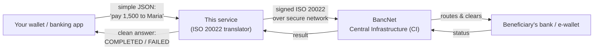
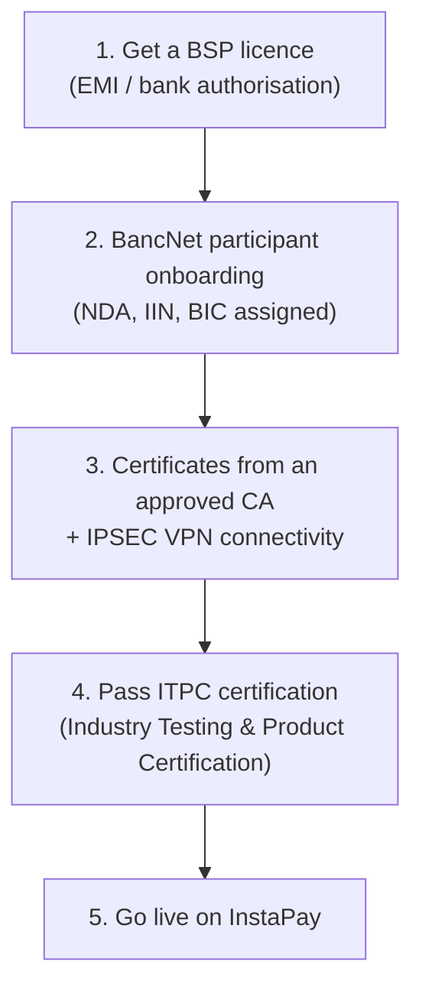

# 1. Overview (start here)

This page is written for **everyone** — business owners, EMI operators, and
newcomers. No technical background needed. Terms in **bold** are defined in the
[Glossary](07-glossary.md).

---

## What is InstaPay?

**InstaPay** is the Philippines' **real-time** electronic fund-transfer service.
It lets people and businesses send money between banks and e-wallets (GCash,
Maya, BDO, BPI, and many more) **instantly, 24/7**, for amounts up to the scheme
limit. It is one of the two automated clearing houses under the country's
**National Retail Payment System (NRPS)**, overseen by the **BSP** (Bangko
Sentral ng Pilipinas) and operated by **BancNet** on the Mastercard / Vocalink
**IPS** (Instant Payment System) platform.

To take part, an institution must be an **InstaPay participant**. Behind the
scenes, participants don't just "send a payment" — they exchange precisely
formatted electronic messages (a global standard called **ISO 20022**), each one
digitally signed, over a secure private network, with a central system
(**BancNet's Central Infrastructure**, or **CI**) sitting in the middle routing
and clearing everything.

---

## What does *this service* do?

This service is the **technical translator and messenger** that sits between your
own applications and InstaPay.

> **Analogy.** Think of InstaPay as an international postal system with very strict
> rules: every letter must be on a specific form, in a specific language, sealed
> with a specific wax stamp, and delivered through one official post office. Your
> business just wants to say "send ₱1,500 to Maria." **This service is the expert
> clerk** who takes your plain request, fills in the official form perfectly (an
> **ISO 20022** message), applies the wax seal (a **digital signature**), drops it
> at the official post office (the **CI**), waits for the delivery receipt, and
> tells you "done" or "rejected — here's why." It also receives incoming letters
> addressed to you and sends back the correct receipt.

Concretely, it:

- **Sends payments** — your app makes one simple request; the service produces a
  signed `pacs.008` credit transfer, submits it, waits for the result, and returns
  a clean outcome (`COMPLETED`, `FAILED`, `TIMED_OUT`, or `REJECTED_AT_SUBMIT`).
- **Receives payments** — accepts incoming credit transfers, hands them to your
  system to credit the beneficiary, and returns the required signed acknowledgement.
- **Handles cancellations** — processes cancellation requests and reverses matched
  payments.
- **Keeps the connection healthy** — sign-on / sign-off and periodic health checks.
- **Enforces security** — mutual **TLS** encryption plus a **digital signature** on
  every message, and validates every message against the official schemas.

### The big picture

---

## Who needs this?

- **EMIs and banks** that want to become (or already are) InstaPay participants and
  need the technical "processor" piece without building the ISO 20022 plumbing
  themselves.
- **Fintech developers / integrators** building a wallet or payment app who want to
  call one clean API instead of learning the full InstaPay message protocol.
- **A shared-processor operator** — one organisation can run this service and let
  several front-end apps (or partner EMIs) send payments through it.

---

## What this service does **not** do

This is deliberately a **thin integration layer**. It intentionally leaves the
"money" parts to your existing systems:

| It does NOT include | You provide this via |
| --- | --- |
| A wallet or ledger (account balances) | Your core-banking / wallet system |
| Crediting/debiting real accounts | Your ledger — the built-in crediting is a **stub** |
| KYC / customer onboarding | Your compliance systems |
| User login / authentication of end-users | Your app |
| A required application database | Nothing — in-flight state is kept in memory |

The place where "credit the beneficiary" happens is a clearly-marked **stub**
(`src/instapay/account.service.ts`) that accepts everything by default. You replace
it with a connector to your real ledger when you're ready.

---

## The licensing & onboarding reality

**Running this software does not connect you to live InstaPay, and does not make
you an EMI.** Please be clear-eyed about what production requires:

| Requirement | What it means |
| --- | --- |
| **BSP licence** | Legal authority to operate as an EMI or bank in the Philippines. |
| **BancNet onboarding** | Sign an **NDA**, receive your **participant ID**, **IIN**, and **BIC**, and get access to the confidential InstaPay specifications. |
| **Certificates & VPN** | A digital certificate from an **approved Certificate Authority**, and an **IPSEC VPN** into BancNet's private network. |
| **ITPC certification** | You must pass BancNet's formal test suite before you're allowed on the live network. |

**Until you are onboarded**, you test this service against the **InstaPay ISO 20022
Simulator** or your own **mock CI** — never against production.

The InstaPay message specifications themselves are **confidential** to BancNet /
Mastercard. See [08 — Security & Compliance](08-security-and-compliance.md) for
what that means for reuse and resale.

---

Next: **[02 — Setup](02-setup.md)** to install and configure, or
**[03 — Architecture](03-architecture.md)** for the technical design.
