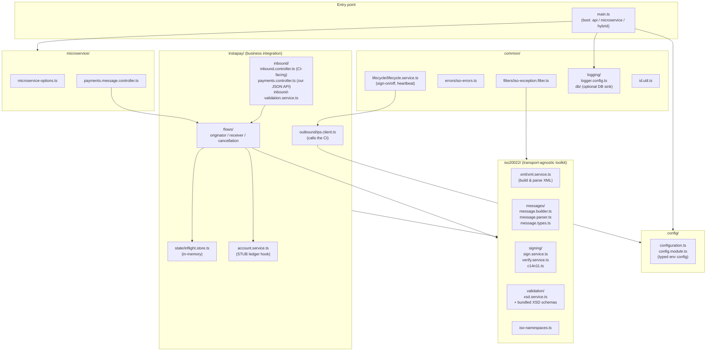
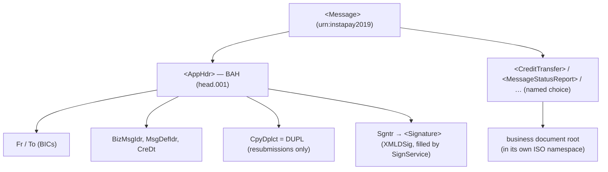
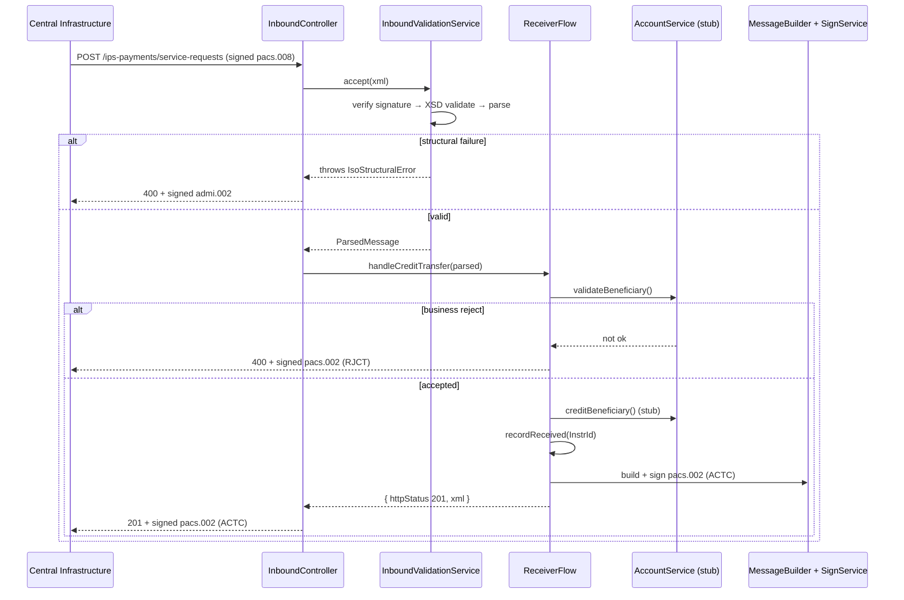
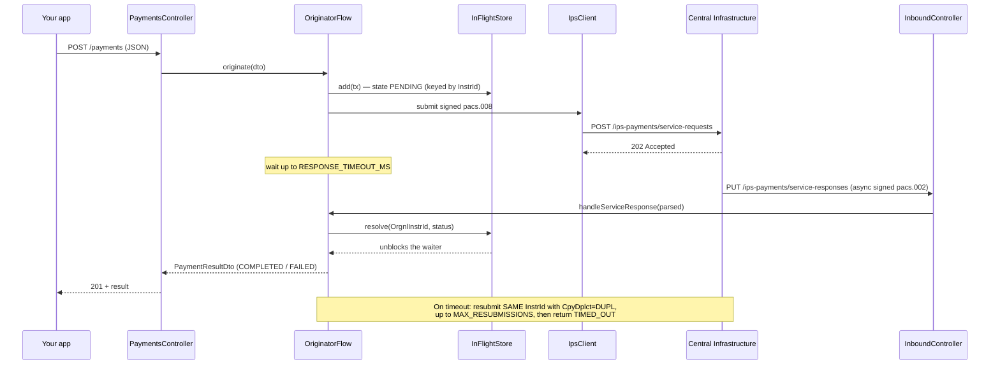
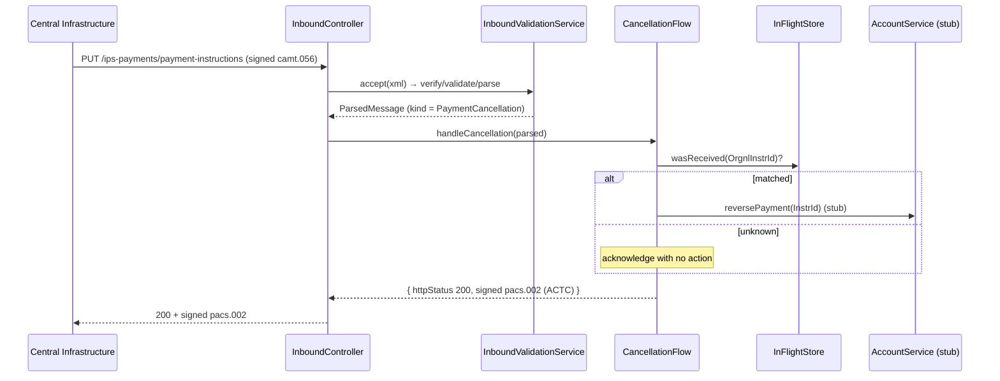

# 3. Architecture

Technical design of the service. Audience: developers and integrators. Acronyms are
defined in the [Glossary](07-glossary.md).

The project is a **NestJS + TypeScript** application. It is organised into a small
number of modules with a clean separation between the **transport-agnostic ISO
20022 toolkit** and the **InstaPay business flows**.

---

## Module map

### What each area is responsible for

| Area | Responsibility |
| --- | --- |
| **`config/`** | Loads and strongly types every environment variable (`configuration.ts`). Nothing else touches `process.env`. |
| **`iso20022/xml/`** | Deterministic XML build/parse (`xml.service.ts`) — order-preserving so output is stable and signable; namespace-prefix-insensitive lookups on parse. |
| **`iso20022/messages/`** | `message.builder.ts` constructs each message type; `message.parser.ts` normalises inbound messages for routing/matching; `message.types.ts` holds the typed parameters and the `TxStatus` enum. |
| **`iso20022/signing/`** | `sign.service.ts` inserts an enveloped XMLDSig signature into the BAH; `verify.service.ts` validates it; `c14n11.ts` registers the C14N 1.1 transform. |
| **`iso20022/validation/`** | `xsd.service.ts` validates messages against the bundled InstaPay XSD schemas using `xmllint-wasm` (WebAssembly libxml2 — no native build). |
| **`instapay/inbound/`** | The **CI-facing** ISO 20022 endpoints (`inbound.controller.ts`), the internal **JSON** origination API (`payments.controller.ts`), and the first-line signature+schema gate (`inbound-validation.service.ts`). |
| **`instapay/outbound/`** | `ips.client.ts` — the HTTP client that calls the CI (submit payment, sign-on/off, health check). Never throws on non-2xx; returns `{ status, body }`. |
| **`instapay/flows/`** | The business logic: **originator** (send), **receiver** (accept), **cancellation** (reverse). |
| **`instapay/state/`** | `inflight.store.ts` — **in-memory** tracking of payments awaiting an async result, keyed by Instruction Id. Behind a small interface so a Redis/Postgres store can be dropped in later. |
| **`instapay/account.service.ts`** | The **stub** ledger hook (`validateBeneficiary`, `creditBeneficiary`, `reversePayment`). Accepts everything by default — replace with your ledger. |
| **`common/filters` + `errors`** | Typed ISO errors and the global filter that renders them as the correct signed response (see below). |
| **`common/lifecycle/`** | Sign-on at boot, sign-off at shutdown, optional health-check heartbeat. |
| **`common/logging/`** | Winston logger config (rotating files by date + level) and the optional DB sink. See [06 — Logging](06-logging.md). |
| **`microservice/`** | The internal transport options and the message-pattern controller mirroring the JSON origination API. |

---

## The message envelope

Every message on the wire is an InstaPay **`<Message>`** envelope
(`targetNamespace urn:instapay2019`) that wraps **two** things:

1. a **Business Application Header** (BAH, `head.001.001.01`) — who it's from/to,
   the message id, the message-definition id, timestamp, a duplicate flag, and the
   **digital signature**; and
2. exactly **one business document** (e.g. `pacs.008`, `pacs.002`), placed under a
   named choice element (`CreditTransfer`, `MessageStatusReport`, `EchoRequest`, …).

**Namespace strategy** (see `message.builder.ts`
and `iso-namespaces.ts`): the envelope, header,
and choice wrapper are in the default `instapay2019` namespace; BAH children use the
`head:` prefix; each business document root **redeclares** the default `xmlns` to its
own ISO namespace so its children inherit it prefix-free. This keeps the output
deterministic and reliably signable.

**Signing** (see `sign.service.ts`): the
BAH is built with an **empty `<Sgntr/>`** placeholder. `SignService` computes a W3C
XMLDSig **enveloped** signature over the whole document (`Reference URI=""`) with an
`enveloped-signature` + `xml-c14n11` transform chain, `rsa-sha256` signature and
`sha256` digest, and appends the `<Signature>` inside `<Sgntr>`. Algorithm URIs live
in `SIG_ALGO` in `iso-namespaces.ts`. Details:
[08 — Security & Compliance](08-security-and-compliance.md#message-signing-xmldsig).

---

## How an inbound request flows

Every inbound message passes through the same first-line gate before any business
logic — signature verification, then XSD validation, then parse
(`inbound-validation.service.ts`).
Failures become signed ISO error responses via the global exception filter
(`iso-exception.filter.ts`):

| Error type | Cause | Response |
| --- | --- | --- |
| `IsoStructuralError` | Parse (`DU01`), signature (`DS02`), or schema (`DU02`) failure | HTTP **400** + signed **`admi.002`** |
| `IsoBusinessError` | Valid message, business rejection | HTTP **400** + signed **`pacs.002`** with `RJCT` |
| `IsoSystemError` / other | Unexpected/system fault | HTTP **500** + Error JSON |

### (a) Receiving a credit transfer (we are the creditor)

### (b) Originating a payment (we are the debtor) with the async `pacs.002` match

This is the most important flow. The reply from the CI to our submission is
**asynchronous**: submitting returns `202`, and the real outcome arrives **later** on
our `service-responses` endpoint, matched by **Instruction Id**.

Outcome states returned to the caller: `COMPLETED`, `FAILED` (`pacs.002` = `RJCT`),
`TIMED_OUT` (no response within the SLA after all resubmissions), or
`REJECTED_AT_SUBMIT` (the CI did not return `202`).

### (c) Cancellation (we are the receiver being asked to reverse)

> Note: a `pacs.002` **confirmation** arriving on `payment-instructions` (not a
> `camt.056`) is a fire-and-forget acknowledgement returning **204**.

---

## In-flight state & idempotency notes

- Originated payments live in `InFlightStore`
  keyed by **Instruction Id**; the async `pacs.002` is matched on its
  `OrgnlInstrId`. Received instruction ids are remembered separately so a later
  `camt.056` cancellation can be matched.
- State is **in memory**: it is not shared across processes and does not survive a
  restart. This matches the integration-only scope; swap in a shared store when you
  add a ledger.

---

Next: **[04 — Integration Guide](04-integration-guide.md)** or
**[05 — API Reference](05-api-reference.md)**.
