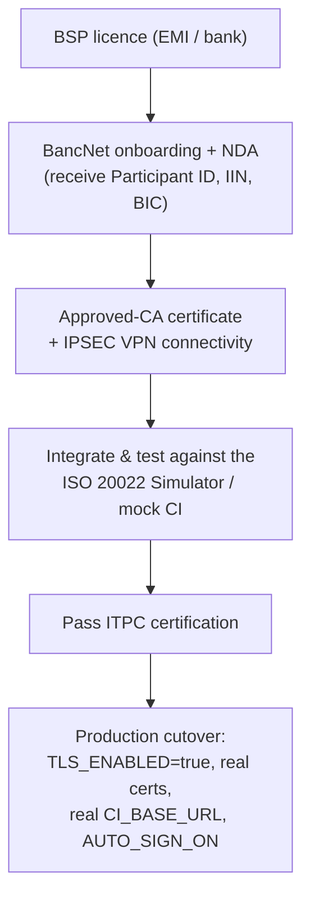

# 8. Security & Compliance

How the service protects messages, how to handle keys and certificates, and what it
takes to go live. Terms are defined in the [Glossary](07-glossary.md).

InstaPay security rests on **two independent layers**: the connection is encrypted
and mutually authenticated (**mutual TLS**), and every individual message is
**digitally signed** (**XMLDSig**). Both must be right in production.

---

## Layer 1: Mutual TLS (the connection)

The inbound HTTPS server can require **mutual TLS** — both ends present certificates
and verify each other, so the CI proves it is the CI and we prove we are us.
Configured in `main.ts` from the `TLS_*` variables:

| Setting | Role |
| --- | --- |
| `TLS_ENABLED` | Turns HTTPS + mTLS on. **Off only for local dev.** |
| `TLS_CERT_PATH` / `TLS_KEY_PATH` | Our server certificate and private key. |
| `TLS_CA_PATH` | The CA bundle we trust for the peer's certificate. |
| `TLS_REQUEST_CLIENT_CERT` | Require and verify the caller's client certificate (`rejectUnauthorized`). |

Our **outbound** client to the CI (`ips.client.ts`)
uses the same certificate/key/CA to establish mutual TLS when `TLS_ENABLED=true`,
with `rejectUnauthorized: true`.

> The internal **microservice** TCP transport can also be secured with TLS + mutual
> auth via `MS_TLS=true` (reusing the participant certs). This is separate from the
> BancNet contract. See [Setup](02-setup.md#internal-microservice-transport).

---

## Layer 2: Message signing (XMLDSig)

Even over a secure connection, **every ISO 20022 message is individually signed** so
the recipient can verify integrity and origin. Implemented in
`sign.service.ts` (sign) and
`verify.service.ts` (verify); algorithm
URIs in `iso-namespaces.ts`.

The signature is a **W3C XMLDSig enveloped signature** placed inside the BAH
`<Sgntr>` element, following the IPS Digital Signing Guide:

| Property | Value |
| --- | --- |
| Signature method | **RSA-SHA256** |
| Digest method | **SHA-256** |
| Reference | `URI=""` — covers the **whole** `<Message>` |
| Transforms | `enveloped-signature` (ignore the signature block itself), then `xml-c14n11` (canonicalize the payload) |
| SignedInfo canonicalization | inclusive **C14N 1.0** |
| Signature placement | appended inside the (initially empty) `<Sgntr>` in the BAH |

**Inbound verification** (`inbound-validation.service.ts`)
is the **first action** on every inbound message: verify the signature, then validate
against the **XSD schemas**, then parse. Any failure becomes a signed `admi.002`
(HTTP 400) — see [Architecture](03-architecture.md#how-an-inbound-request-flows).

**Trust model.** By default the verifier uses the certificate embedded in the
message's `KeyInfo` (self-contained — good for tests and mTLS peers). In production,
**pin the CI's certificate** via `TLS_CA_PATH` so a message is only trusted if signed
by the expected scheme key.

---

## Key & certificate handling

The **same** private key/certificate pair is used both for the TLS server and for
signing messages (`TLS_KEY_PATH` / `TLS_CERT_PATH`).

### Rules

- **Never commit real keys or certificates.** `.gitignore` already excludes
  `certs/*.key`, `certs/*.crt`, `certs/*.pem`, and `certs/*.p12` (only `.gitkeep` is
  kept). Keep private keys out of version control, chat, and tickets.
- **Development certificates are throw-away.** `npm run gen:certs`
  (`gen-dev-certs.js`) creates a **self-signed** pair
  for local use only. They are not trusted by anyone and must never reach production.
- **Production certificates come from an approved CA.** During BancNet onboarding you
  obtain a certificate from a BancNet-approved **Certificate Authority**. Use that
  key/cert in production and protect the private key (restricted file permissions,
  secret store / HSM where possible).
- **Rotate** certificates before expiry and re-run certification if required.

---

## Confidentiality (NDA) — important for reuse & resale

The InstaPay message specifications (the API Guide, MIG, VAM, Digital Signing Guide,
Participant Data Sheet, and the XSD schemas derived from them) are **confidential to
BancNet / Mastercard** and are released to you under a **Non-Disclosure Agreement**
during onboarding.

Implications:

- Do **not** publish, share, or redistribute the specifications, the derived schemas,
  or scheme-specific code/values outside your onboarded organisation.
- **Reselling or offering this service to third parties** (e.g. as a shared processor
  for other institutions) may require explicit permission from BancNet and each party
  being an onboarded participant. Confirm what your NDA and participant agreement
  allow before doing so.
- Treat scheme codes, endpoint details, and certificates as sensitive material.

---

## The path to production (ITPC)

Running this software does **not** connect you to live InstaPay. The route to going
live:

### Production readiness checklist

- [ ] BSP licence and BancNet participant onboarding complete (NDA signed).
- [ ] Real `PARTICIPANT_ID`, `PARTICIPANT_BICFI`, IIN configured.
- [ ] CA-issued certificate/key installed; dev certs removed.
- [ ] `TLS_ENABLED=true`, `TLS_REQUEST_CLIENT_CERT=true`, `TLS_CA_PATH` pinned to the CI.
- [ ] `CI_BASE_URL` / `CI_BICFI` set to the real environment; connectivity over IPSEC VPN verified.
- [ ] SLA timers (`RESPONSE_TIMEOUT_MS`, `MAX_RESUBMISSIONS`) tuned to scheme requirements.
- [ ] Beneficiary crediting **stub** (`account.service.ts`) replaced with a real ledger connector.
- [ ] In-flight state moved to a shared/durable store if running more than one instance.
- [ ] Logging retention (and optional DB sink) configured; payloads kept out of `info` logs.
- [ ] ITPC certification passed.

---

Back to the **`documentation index`**.
