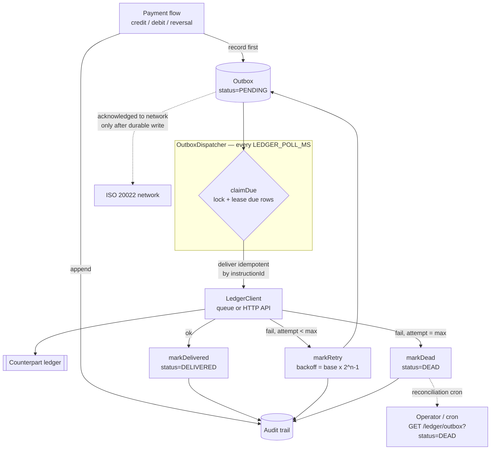

# 9. Ledger & Audit (money-safe delivery)

How the service makes sure **every peso is accounted for**: when a payment moves
money, that movement is recorded durably *before* anything is acknowledged, then
delivered to the counterpart **ledger** (the bank core / partner service) with
retries until it is confirmed — and every step is written to an **audit trail** so
you can prove exactly what came in and what was posted. Terms are defined in the
[Glossary](07-glossary.md).

---

## The problem this solves

A payment network is asynchronous and unreliable: the ledger might be briefly down,
a queue might be slow, the process might restart mid-delivery. Two failures must
**never** happen with money:

1. **Lost** — we acknowledged a payment to the network but never posted it.
2. **Double-booked** — we posted the same movement twice on a retry.

The design below makes the first impossible (durable record before ack) and the
second impossible (idempotent delivery).

---

## The money-safe pattern (transactional outbox)

Every money movement follows the same path:

1. **Record first.** The payment flow calls
   `LedgerService`, which writes the movement to
   a durable **outbox** and an **audit** entry in the same step. Nothing is
   acknowledged to the network without this durable record.
2. **Dispatch with retries.** The
   `OutboxDispatcher` polls the outbox for due
   events and delivers each to the ledger via
   `LedgerClient` — either an HTTP API POST
   (`LEDGER_MODE=api`) or a message queue (`LEDGER_MODE=queue`, durable, recommended).
3. **Idempotent delivery.** Delivery is keyed by `instructionId`, so the ledger
   dedupes: a retry of an already-posted event is a no-op. Retries can never
   double-book.
4. **Backoff + dead-letter.** On failure the event is retried with **exponential
   backoff** (`LEDGER_BACKOFF_MS × 2^(attempt-1)`). After `LEDGER_MAX_ATTEMPTS` it
   is moved to **`DEAD`** (dead-letter) for the reconciliation cron / an operator to
   resolve — it is never silently dropped.
5. **Audit everything.** Each step appends to the audit trail: `RECEIVED`,
   `ENQUEUED`, `DELIVERY_ATTEMPT`, `DELIVERY_OK`, `DELIVERY_FAILED`, `DEAD_LETTER`.



---

## Concurrency: many pods, no double-delivery

The dispatcher is designed to run on **multiple instances/pods at once** without two
of them ever grabbing the same event. `claimDue` runs a **locked, leased claim**:

- **Postgres:** `UPDATE ... WHERE id IN (SELECT ... WHERE status='PENDING' AND
  next_attempt_at <= :now ORDER BY next_attempt_at LIMIT :n FOR UPDATE SKIP LOCKED)
  RETURNING *` — a single atomic statement.
- **MySQL 8+:** `SELECT ... FOR UPDATE SKIP LOCKED` then `UPDATE`, inside one
  transaction.
- **SQL Server:** table hints `WITH (UPDLOCK, READPAST, ROWLOCK)` — `READPAST` is
  the `SKIP LOCKED` equivalent.

`SKIP LOCKED` / `READPAST` means a poller **skips** rows another poller already holds
instead of blocking on them. The claim also pushes `next_attempt_at` forward (a
short **lease**), so even after the lock is released the row stays invisible to other
pollers while it is being delivered. If a pod crashes mid-delivery, the lease expires
and another pod retries — at-least-once delivery, made safe by idempotency.

Source: `src/ledger/db/db-outbox.store.ts`.

---

## The SEPARATE, transactional ledger database

The outbox + audit live in their **own dedicated, transactional database** —
completely **separate** from the [logs DB](06-logging.md#optional-database-logging):

| | Ledger DB | Logs DB |
| --- | --- | --- |
| Purpose | Money movements — **must not be lost** | Observability — best-effort |
| Config | `LEDGER_DB_*` | `DB_*` / `LOG_DB_*` |
| Connection | `ledger-datasource.ts` | `logs-datasource.ts` |
| On failure | Log + retry lazily; never crash the app | Drop the batch; never block a request |

They share **no pool and no failure domain**: a log-sink outage can never affect
money handling, and vice versa.

**Storage is pluggable** behind the `OUTBOX_STORE` / `AUDIT_STORE` DI tokens
(`ledger.module.ts`):

- `LEDGER_DB_ENABLED=false` (default) → **in-memory** stores. The app boots with no
  database — for dev/test only, **not durable** across restarts.
- `LEDGER_DB_ENABLED=true` → **DB-backed** stores against the ledger database. The
  DataSource is built lazily and best-effort, so a briefly-unreachable DB never
  crashes boot.

Set the connection with `LEDGER_DB_TYPE` / `HOST` / `PORT` / `USERNAME` / `PASSWORD`
/ `DATABASE` / `SCHEMA` / `SSL` — see [Setup](02-setup.md#ledger-database-separate-transactional--not-the-logs-db).

---

## Billions-scale schema

Create the tables from the DDL for your engine — the schema is DDL-managed
(TypeORM `synchronize` is off):

- `db/postgres/ledger-schema.sql`
- `db/mysql/ledger-schema.sql`
- `db/mssql/ledger-schema.sql`

### `audit_log` — append-heavy, grows to billions

- **Monthly RANGE partitioning on `ts`.** Time-bounded reads prune to the relevant
  month(s); retention is an **instant DROP/SWITCH** of an old partition instead of a
  giant, lock-heavy `DELETE`.
- **Postgres BRIN index on `ts`.** The audit trail is inserted in ~time order, so
  physical row order tracks `ts`. BRIN stores only per-block min/max — kilobytes for
  billions of rows — perfect for time-range scans. (MySQL uses the clustered PK +
  partition pruning; SQL Server uses a partition-aligned clustered index — neither
  has BRIN.)
- **btree/nonclustered indexes** on `(instruction_id)` and `(action, ts)` for the
  audit filters.

### `outbox_events` — smaller hot set, built for scale

- **UNIQUE `(instruction_id, type)`** — the **idempotency constraint**. `enqueue`
  uses `INSERT ... ON CONFLICT DO NOTHING` (pg) / `INSERT IGNORE` (mysql) / a guarded
  insert (mssql), so a duplicate returns the existing row instead of booking a second.
- **Partial / filtered index on `(status, next_attempt_at) WHERE status='PENDING'`**
  (Postgres partial index; MySQL/SQL Server composite/filtered index). The dispatcher
  poll stays **O(due rows)** even with millions of `DELIVERED` rows in the table.
- **Index on `(instruction_id)`** for point lookups.
- **Retention:** archive/prune `DELIVERED` rows periodically; keep `DEAD` rows for
  reconciliation.

---

## Verifying and reconciling

Two JSON read APIs (source:
`ledger.controller.ts`) let you — or a
**reconciliation cron** on the counterpart service — check exactly what happened:

| Endpoint | Use |
| --- | --- |
| `GET /audit?instructionId=&action=&since=&limit=` | The full trail: what arrived (`RECEIVED`), what was queued (`ENQUEUED`), and every delivery result. |
| `GET /ledger/outbox?status=&limit=` | Outbox state — `PENDING` (in flight), `DELIVERED`, or `DEAD` (needs reconciliation). |
| `GET /payments?since=` | The transaction journal (inbound + outbound). |

### Reconciliation cron pattern

A partner or internal job runs on a schedule and cross-checks the three views:

```
every N minutes:
  txns  = GET /payments?since=<last_watermark>     # what the network saw
  audit = GET /audit?since=<last_watermark>         # what we recorded/posted
  dead  = GET /ledger/outbox?status=DEAD            # what failed delivery

  for each payment in txns:
      assert a matching DELIVERY_OK exists in audit  # posted to the ledger?
  alert/resolve every row in dead                    # nothing left stuck
  advance <last_watermark>
```

Because delivery is idempotent, re-driving a `DEAD` event (after fixing the cause)
is always safe: the ledger will dedupe if it had in fact already been posted.

---

## Configuration summary

| Group | Variables |
| --- | --- |
| Delivery | `LEDGER_ENABLED`, `LEDGER_MODE`, `LEDGER_URL`, `LEDGER_QUEUE_TRANSPORT`, `LEDGER_QUEUE_URL`, `LEDGER_QUEUE_NAME` |
| Retry policy | `LEDGER_MAX_ATTEMPTS`, `LEDGER_POLL_MS`, `LEDGER_BACKOFF_MS` |
| Ledger DB (separate) | `LEDGER_DB_ENABLED`, `LEDGER_DB_TYPE`, `LEDGER_DB_HOST`, `LEDGER_DB_PORT`, `LEDGER_DB_USERNAME`, `LEDGER_DB_PASSWORD`, `LEDGER_DB_DATABASE`, `LEDGER_DB_SCHEMA`, `LEDGER_DB_SSL` |

Every variable is explained in [02 — Setup](02-setup.md#ledger-delivery-money-safe-outbox--counterpart-ledger).

---

Back to the **`documentation index`**.
