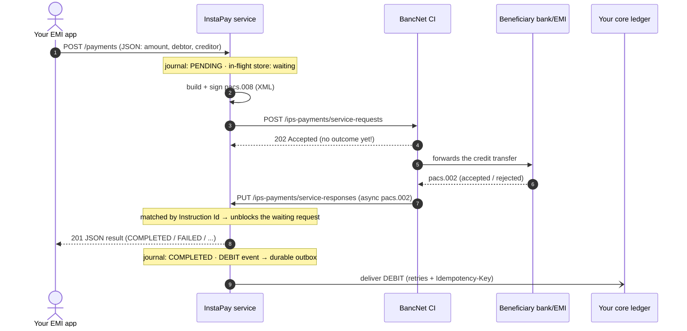
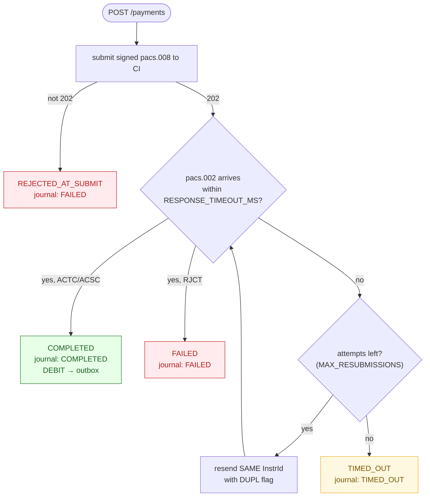
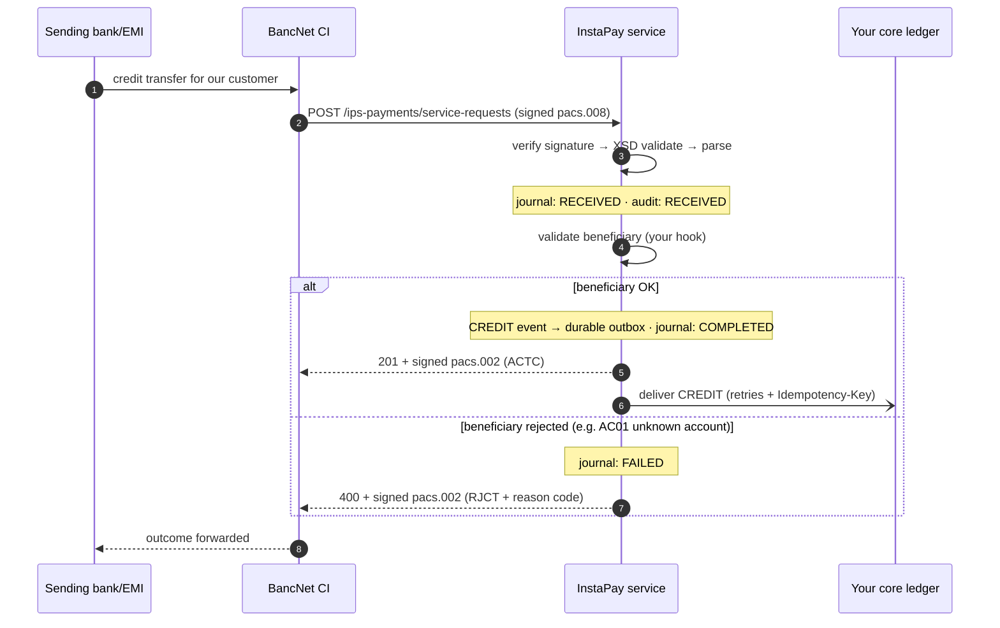
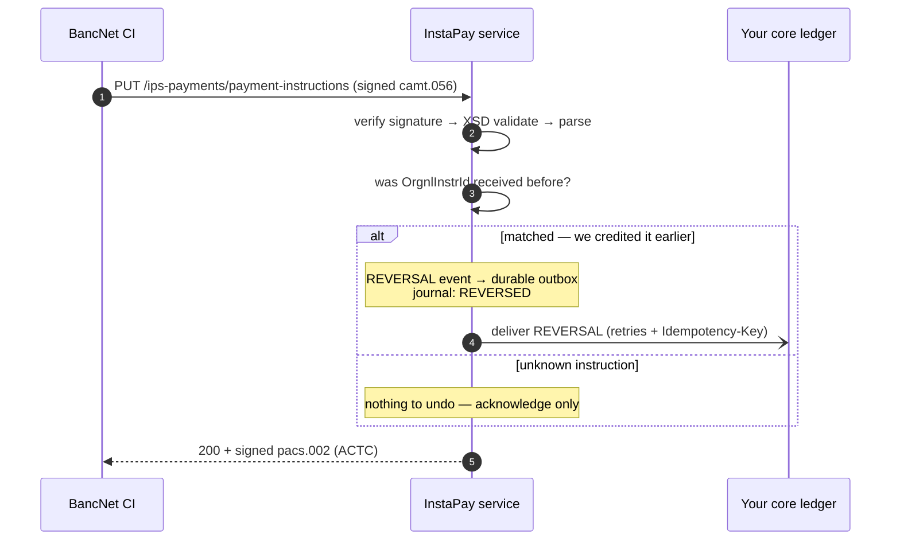
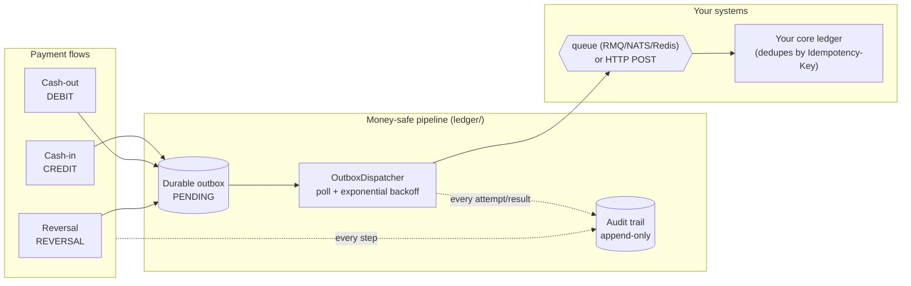
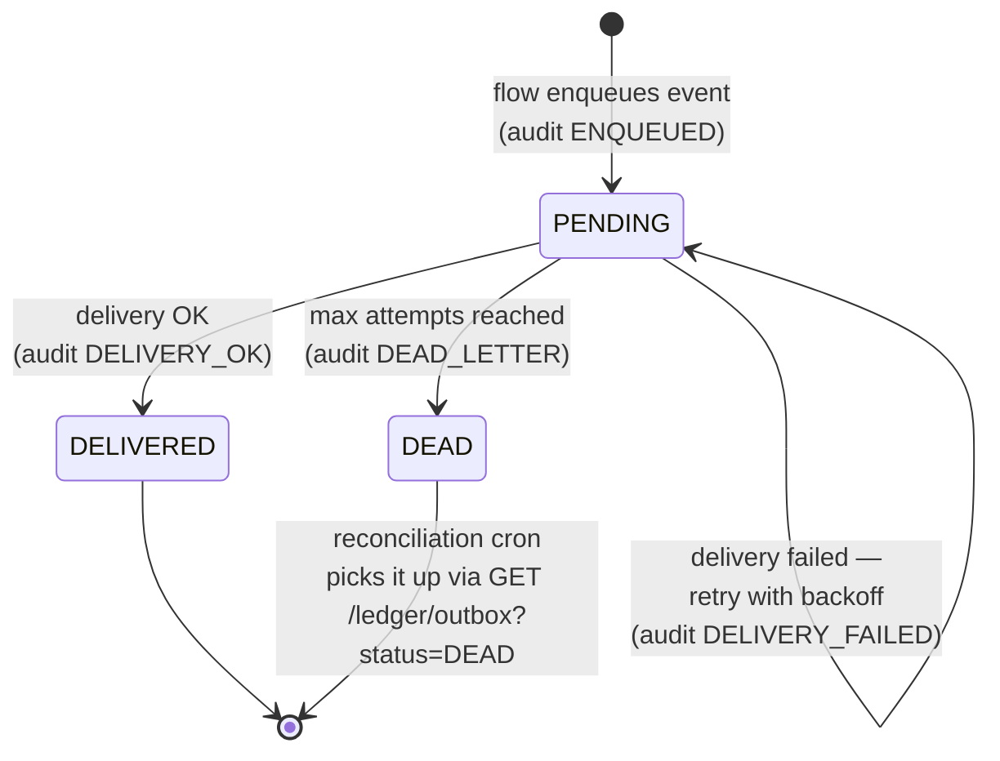
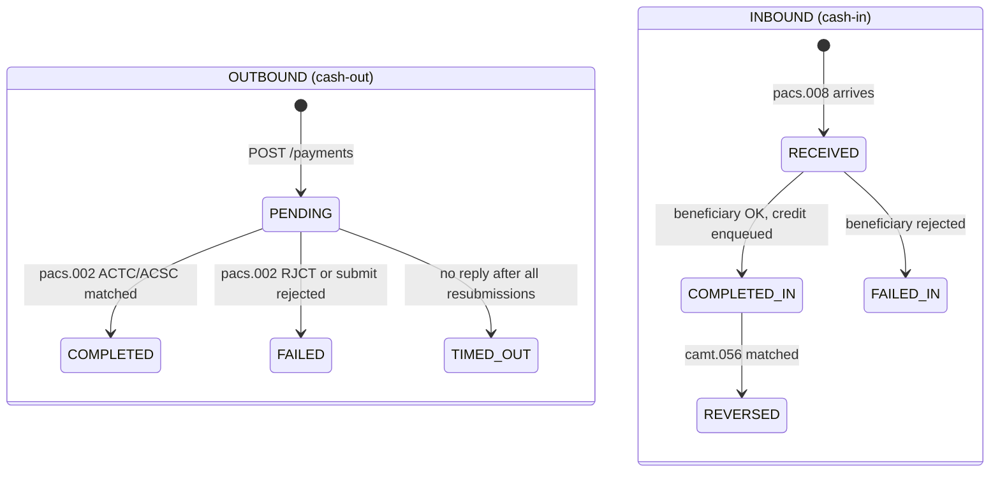

# 10. Transaction Flows — Cash-In, Cash-Out, Reversal

End-to-end diagrams of every **money movement** through the service, in business
terms. Each flow shows the complete journey: who calls what, which message goes
where, what is recorded, and where the money record finally lands.

> **Companion doc:** for the exact **code path** of each endpoint (file → class →
> method, step by step), see
> [docs/code/11 — Request Walkthroughs](code/11-request-walkthroughs.md).

## Terminology map — business vs. wire

| Business term | What it means here | Wire message | Flow class |
| --- | --- | --- | --- |
| **Cash-out / Send money** | *Our* customer pays someone at another bank/EMI. We are the **originator (debtor side)**. | outbound `pacs.008`, async result `pacs.002` | `originator.flow.ts` |
| **Cash-in / Receive money** | Someone at another bank/EMI pays *our* customer. We are the **receiver (creditor side)**. | inbound `pacs.008`, our reply `pacs.002` | `receiver.flow.ts` |
| **Reversal / Cancellation** | The network asks us to undo a payment we already received. | inbound `camt.056`, our reply `pacs.002` | `cancellation.flow.ts` |
| **Ledger posting** | The durable, retried delivery of each CREDIT / DEBIT / REVERSAL to *your* core ledger. | JSON over queue or HTTP | `outbox.dispatcher.ts` |

Two independent record systems observe every flow:

- **Transaction journal** (protocol view) — one record per payment, status
  `PENDING → COMPLETED / FAILED / TIMED_OUT / RECEIVED / REVERSED`. Read via
  `GET /payments`. Persisted to the ledger DB (`transactions` table) when
  `JOURNAL_DB_ENABLED=true`, so the reconciliation feed survives restarts.
- **Ledger outbox + audit trail** (money view) — one durable event per money
  movement plus an append-only audit line for everything that happens to it.
  Read via `GET /ledger/outbox` and `GET /audit`.

---

## Flow A — Cash-out (your app sends money)

Your application calls one JSON endpoint; everything else — XML, signing,
submission, waiting for the async result, retries, ledger posting — happens
inside the service.

### Cash-out outcome states

**Duplicate safety:** a resend reuses the *same* Instruction Id with the BAH
`CpyDplct=DUPL` flag, so the network can never double-pay — at-least-once
submission, at-most-once settlement.

---

## Flow B — Cash-in (your customer receives money)

The CI pushes a signed `pacs.008` at us. We validate, record, enqueue the credit
for your ledger, and answer **synchronously** with a signed `pacs.002`.

Key property: **nothing is ever ACKed to the network without a durable record.**
The `pacs.002 ACTC` is only sent after the CREDIT event is safely in the outbox
and the audit trail — see [docs/09 — Ledger & Audit](09-ledger-and-audit.md).

---

## Flow C — Reversal (the network cancels a received payment)

A `camt.056` asks us to undo a payment we previously received (Flow B).

We always reply with a valid signed `pacs.002` — even for an unknown instruction
— so the CI stops re-sending the cancellation.

---

## Flow D — Ledger delivery (how a money event reaches your core)

Every CREDIT (cash-in), DEBIT (cash-out), and REVERSAL from the flows above goes
through the same **money-safe pipeline**: durable outbox → retrying dispatcher →
your ledger. This runs in the background, decoupled from the network reply.

### Outbox event lifecycle

- **Idempotent:** the `instructionId` travels as the idempotency key
  (`Idempotency-Key` HTTP header / message field), so retries can never
  double-book.
- **`LEDGER_ENABLED=false`** (default): events still land in the outbox and audit
  trail — recorded and queryable, just not delivered yet.
- Dead-lettered events are never lost: they stay queryable at
  `GET /ledger/outbox?status=DEAD` for your reconciliation cron.

---

## Journal status lifecycle (both directions)

The transaction journal is the reconciliation view your systems poll
(`GET /payments?since=...`). Its statuses:

(`COMPLETED_IN` / `FAILED_IN` are the same `COMPLETED` / `FAILED` values, shown
separately per direction.)

---

## Which records to check, when

| Question | Endpoint | Backed by |
| --- | --- | --- |
| "What happened to payment X?" | `GET /payments/{instructionId}` | journal |
| "What changed since my last poll?" (reconciliation) | `GET /payments?since=...` | journal |
| "Did the money event reach our ledger?" | `GET /audit?instructionId=X` | audit trail |
| "Is anything stuck or dead-lettered?" | `GET /ledger/outbox?status=PENDING\|DEAD` | outbox |
| "Show me the service logs for this payment" | `GET /logs?instructionId=X` | logs DB |

Same queries exist as message patterns for queue-based reconciliation — see the
[API Reference](05-api-reference.md#microservice-message-patterns).

---

Next: **[docs/code/11 — Request Walkthroughs](code/11-request-walkthroughs.md)** —
the same flows traced through the actual source files, step by step.
