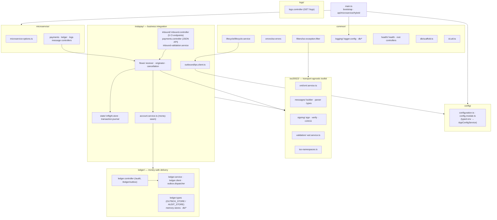

# Code Documentation — Index

> **In plain terms.** This is the **guided tour of the source code** for the
> InstaPay integration service. Every page starts with a plain-language "In plain
> terms" box for non-technical readers (business owners, operations), then gives the
> technical detail, then links straight to the real code files so a developer can
> jump in. Read top to bottom for the full picture, or jump to the page you need.

**What this service is:** an **InstaPay ISO 20022 integration service** for the
Philippines. An EMI or bank connects it to InstaPay (BancNet / Mastercard IPS) to
**send and receive real-time PHP credit transfers**. Integrators use a simple JSON
API; the service reconstructs signed ISO 20022 XML internally for the BancNet Central
Infrastructure (CI). It also includes a money-safe ledger-delivery subsystem
(durable outbox + audit + retrying dispatcher), rotating and optional database
logging, three run modes (api / microservice / hybrid), and database auto-scaffolding.

Built with **NestJS + TypeScript**.

---

## How to read this documentation

| If you are… | Start with |
| --- | --- |
| A business owner / ops, want the gist | [01 — Big Picture](01-big-picture.md) + [Transaction Flows](../10-transaction-flows.md) |
| An integrator sending payments | [04 — Flows](04-instapay-flows.md) + [Integration Guide](../04-integration-guide.md) |
| A developer onboarding to the code | Read [01](01-big-picture.md) → [11](11-request-walkthroughs.md) in order |
| Debugging "where does this request go?" | [11 — Request Walkthroughs](11-request-walkthroughs.md) |
| Wiring your ledger / extending | [09 — Extending](09-extending.md) |
| An operator running it | [07 — Runtime & Modes](07-runtime-and-modes.md) + [06 — Logging](06-logging-and-query.md) |

Every `file.ts` reference is a clickable link to the actual source
(e.g. `receiver.flow.ts`).

---

## Map of the codebase

### Module responsibilities at a glance

| Area | Responsibility | Page |
| --- | --- | --- |
| `config/` | Typed env config; the only place that reads `process.env`. | [02](02-config.md) |
| `iso20022/` | Build/parse XML, sign/verify (XMLDSig), XSD validate. | [03](03-iso20022.md) |
| `instapay/` | CI endpoints, JSON API, the send/receive/cancel flows, in-flight state, journal. | [04](04-instapay-flows.md) |
| `ledger/` | Durable outbox + audit + retrying dispatcher; queue/HTTP delivery. | [05](05-ledger-money-safe.md) |
| `common/logging/` + `logs/` | Console + rotating files, optional DB logging, query APIs. | [06](06-logging-and-query.md) |
| `main.ts` + `microservice/` | Bootstrap, run modes, TLS, health, Swagger. | [07](07-runtime-and-modes.md) |
| Persisted data | `outbox_events`, `audit_log`, `app_logs`, in-memory journal. | [08](08-data-model.md) |
| Extension seams | AccountService, DB stores, message patterns/types. | [09](09-extending.md) |
| `common/errors` + `filters` | Typed ISO errors + global exception filter. | [10](10-error-handling.md) |

---

## The pages

| # | Page | Covers |
| --- | --- | --- |
| 01 | [Big Picture](01-big-picture.md) | Non-technical: what it does + the journey of money. |
| 02 | [Configuration & Environment](02-config.md) | `src/config/`, `AppConfigService`, every env group. |
| 03 | [ISO 20022 Toolkit](03-iso20022.md) | XML, builders/parsers, the `<Message>` envelope + BAH, signing, XSD. |
| 04 | [InstaPay Flows](04-instapay-flows.md) | 5 CI endpoints, JSON API, `ips.client`, receiver/originator/cancellation, in-flight matching, journal. |
| 05 | [Ledger & Money-Safe Delivery](05-ledger-money-safe.md) | Outbox + audit + dispatcher, store contract, in-memory vs DB. |
| 06 | [Logging & Query](06-logging-and-query.md) | Console/file rotation, optional DB logging, `GET /logs` + `logs.query`. |
| 07 | [Runtime & Modes](07-runtime-and-modes.md) | Bootstrap, mTLS, body parsing, api/microservice/hybrid, health, Swagger. |
| 08 | [Data Model](08-data-model.md) | `outbox_events`, `audit_log`, `app_logs`, journal shape; two separate DBs. |
| 09 | [Extending Safely](09-extending.md) | AccountService, DB stores, message patterns, new message types. |
| 10 | [Error Handling](10-error-handling.md) | Typed ISO errors + the global filter (admi.002 / pacs.002 RJCT / JSON). |
| 11 | [Request Walkthroughs](11-request-walkthroughs.md) | **Every endpoint, step by step**: where a request goes next through the code — cash-out, cash-in, reversal, reads, background jobs, error paths. |

---

## Related: the top-level documentation

This `docs/code/` set focuses on the **source code**. The top-level
[`docs/`](../) set covers product, setup, and operations — the two cross-reference
each other:

| # | Doc | Focus |
| --- | --- | --- |
| 01 | [Overview](../01-overview.md) | Non-technical intro, who needs it, licensing reality. |
| 02 | [Setup](../02-setup.md) | Install, configure, run; full env var reference. |
| 03 | [Architecture](../03-architecture.md) | System design, module map, inbound flow diagrams. |
| 04 | [Integration Guide](../04-integration-guide.md) | Originating payments, **sample payloads by destination**, CI endpoints, microservice mode. |
| 05 | [API Reference](../05-api-reference.md) | Concise endpoint/pattern reference. |
| 06 | [Logging](../06-logging.md) | Operational logging detail. |
| 07 | [Glossary](../07-glossary.md) | All acronyms defined. |
| 08 | [Security & Compliance](../08-security-and-compliance.md) | mTLS, XMLDSig, keys/certs, ITPC path. |
| 09 | [Ledger & Audit](../09-ledger-and-audit.md) | Money-safe pattern, billions-scale schema rationale. |
| 10 | [Transaction Flows](../10-transaction-flows.md) | End-to-end cash-in / cash-out / reversal diagrams, state lifecycles. |

---

Start the tour: **[01 — The Big Picture](01-big-picture.md)**.
