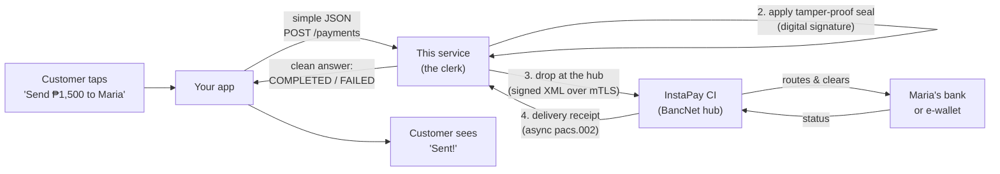
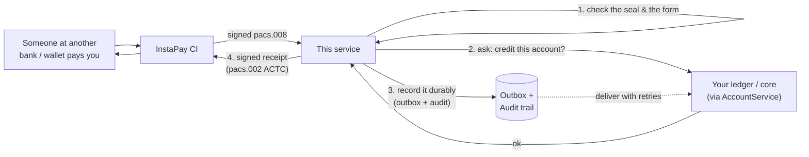

# 01 — The Big Picture (non-technical)

> **In plain terms.** Imagine InstaPay as a **nationwide instant courier for
> money**. Any bank or e-wallet in the Philippines can drop a "money letter" into
> this courier, and it arrives at the recipient's bank or wallet in seconds, any
> hour of any day. But the courier is fussy: every letter must be on an official
> form, written in one exact language, and sealed with a tamper-proof stamp.
> **This software is your expert clerk.** Your app just says "send ₱1,500 to
> Maria"; the clerk fills in the official form perfectly, stamps it, hands it to
> the courier, waits for the delivery receipt, and tells you plainly: *done* or
> *rejected, here's why*. It also receives incoming money letters addressed to
> you and mails back the correct receipt.

This page explains, with no code, **what the system does** and **how one payment
travels end to end**. The rest of this documentation then zooms into each part.

---

## The cast of characters

| Who | Plain-terms role |
| --- | --- |
| **Your app** (wallet / core banking) | Where a customer taps "Send money". Owns the real account balances. |
| **This service** | The ISO 20022 "clerk". Translates a simple request into the official message, signs it, sends it, tracks the result. It does **not** hold balances. |
| **InstaPay CI** (Central Infrastructure) | BancNet / Mastercard's central hub that routes and clears every payment between institutions. Runs on the Mastercard IPS platform. |
| **The other bank / e-wallet** | Where the money lands (GCash, Maya, BDO, BPI, …). |
| **The ledger** (your core / partner) | The system of record where money movements are actually posted. This service *delivers* movements to it safely, but does not *own* it. |

Jargon, defined once:

- **ISO 20022** — the global standard "language" for payment messages. Each
  message type has a code, e.g. `pacs.008` = "please make this credit transfer",
  `pacs.002` = "here is the status of that transfer".
- **EMI** — Electronic Money Issuer (an e-wallet operator), one kind of InstaPay
  participant. A bank is another.
- **BIC** — a bank/wallet's international routing code (e.g. `BNORPHMMXXX`). It
  tells InstaPay which institution the money is for.
- **Digital signature** — a tamper-proof electronic seal on each message.
- **mutual TLS** — an encrypted, both-sides-verified private connection.

---

## What the system does, in one breath

1. **Sends money out** — turns one JSON request into a signed ISO 20022 credit
   transfer, submits it to InstaPay, waits for the asynchronous result, and
   returns a clean outcome.
2. **Receives money in** — accepts incoming credit transfers, asks your system to
   credit the beneficiary, and returns the required signed acknowledgement.
3. **Handles cancellations** — processes cancellation requests and reverses a
   matched payment.
4. **Never loses a peso** — before acknowledging anything, it records the money
   movement in a durable **outbox** and an **audit trail**, then delivers it to
   your ledger with automatic retries.
5. **Stays healthy & observable** — signs on/off with the network, runs health
   checks, and logs everything (rotating files, optional database).

---

## The journey of money (outbound: you pay someone)

**Step by step:**

1. The customer sends money; your app makes **one** JSON call to this service.
2. The service builds the official credit-transfer message (`pacs.008`) and seals
   it with a digital signature.
3. It submits the signed message to the InstaPay CI over the secure private
   connection. The CI accepts it immediately (a quick "got it").
4. Moments later the **real result** comes back *asynchronously* on a separate
   channel — a status report (`pacs.002`). The service matches it to your original
   request and unblocks your call with the outcome (`COMPLETED`, `FAILED`,
   `TIMED_OUT`, or `REJECTED_AT_SUBMIT`).
5. If the result is slow, the service safely re-sends the **same** payment marked
   as a duplicate, so InstaPay never double-pays. If it still never comes, you get
   `TIMED_OUT`.

## The journey of money (inbound: someone pays you)

**Step by step (the reverse):**

1. The CI delivers an incoming credit transfer to us as a signed message.
2. **First thing, every time:** we check the tamper-proof seal and that the form
   is grammatically correct. A bad message gets a signed rejection, not silence.
3. We ask your ledger whether to accept and credit the beneficiary.
4. We record the movement durably **before** acknowledging, then return the
   required signed receipt to the CI.
5. In the background, a dispatcher delivers the recorded movement to your ledger
   with retries until it is confirmed — so nothing is ever lost or double-posted.

---

## What it deliberately does NOT do

This is a **thin integration layer**. It leaves the "money" parts to your systems:

| Not included here | You provide it via |
| --- | --- |
| Account balances / a wallet | Your core-banking or wallet system |
| Actually crediting/debiting accounts | Your ledger — the built-in hook is a **stub** (`account.service.ts`) |
| KYC / onboarding customers | Your compliance systems |
| End-user login | Your app |

---

## Important reality check

Running this software **does not** connect you to live InstaPay and **does not**
make you an EMI. Production requires a **BSP licence**, **BancNet onboarding**
(NDA, participant ID, IIN, BIC), **approved-CA certificates + VPN**, and passing
**ITPC certification**. Until then you test against the InstaPay **simulator** or a
**mock CI** — never production. See the top-level
[Overview](../01-overview.md) and [Security & Compliance](../08-security-and-compliance.md).

---

Next: **[02 — Configuration & Environment](02-config.md)** ·
Back to the **[code docs index](00-index.md)**.
