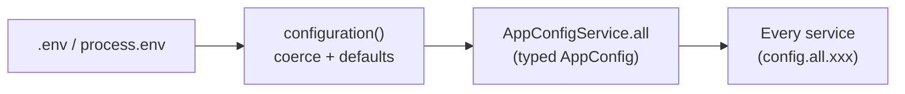

# 02 — Configuration & Environment

> **In plain terms.** Every setting the service needs — which port to listen on,
> who *we* are on the network, where InstaPay lives, our security certificates,
> how long to wait for replies — is read from a single **settings sheet** (the
> environment, i.e. the `.env` file). One small piece of code reads that sheet
> once at startup, checks the values, fills in sensible defaults, and hands the
> rest of the app a clean, typed object. Nothing else in the codebase is allowed
> to peek at raw environment variables — so there is exactly **one place** to look
> when you wonder "where does this value come from?".

**Code:** `src/config/configuration.ts` ·
`src/config/config.module.ts`

Jargon: an **environment variable** is a named value supplied to the process by the
operating system or a `.env` file (e.g. `PORT=8443`). **DI** = dependency
injection, NestJS's way of handing a shared object to whoever asks for it.

---

## How config is loaded

1. `configuration.ts` exports a **factory
   function** that reads `process.env`, coerces types, applies defaults, and
   returns one typed `AppConfig` object. Two helpers do the coercion:
   - `bool(v, def)` — treats `1 / true / yes / on` as true.
   - `int(v, def)` — parses an integer, falling back to the default if invalid.
2. `config.module.ts` registers it with
   NestJS's `ConfigModule.forRoot({ isGlobal: true, load: [configuration], cache: true })`
   and exposes a typed wrapper service.

### `AppConfigService` — the typed accessor

`AppConfigService` (`@Injectable`, `@Global`) is what the rest of the app injects.
It has a **single getter**:

```ts
config.all   // → the whole typed AppConfig object
```

There are **no per-section getters** (no `getTls()`); you reach a section as a
property, e.g. `config.all.tls.certPath`, `config.all.timers.responseTimeoutMs`,
`config.all.ci.bicfi`. Because the module is `@Global`, any provider can inject
`AppConfigService` without importing the module.



---

## The config groups

Each group is a typed section of `AppConfig`. Below: the property, its env var, and
its default.

### Top level

| Property | Env var | Default | Meaning |
| --- | --- | --- | --- |
| `mode` | `APP_MODE` | `api` | Run mode: `api` \| `microservice` \| `hybrid` (see [07 — Runtime & Modes](07-runtime-and-modes.md)). |
| `port` | `PORT` | `8443` | HTTP(S) listen port. |
| `autoSignOn` | `AUTO_SIGN_ON` | `false` | Sign on to the network automatically at boot. |

### `participant` — who *we* are

| Property | Env var | Default |
| --- | --- | --- |
| `id` | `PARTICIPANT_ID` | `PARTICIPANT001` |
| `bicfi` | `PARTICIPANT_BICFI` | `NRLDPHM1XXX` |
| `name` | `PARTICIPANT_NAME` | `NRLDCM EMI` |

> The debtor's servicing agent BIC on every outbound payment is
> `participant.bicfi` — callers never supply it.

### `ci` — the Central Infrastructure (BancNet hub)

| Property | Env var | Default |
| --- | --- | --- |
| `baseUrl` | `CI_BASE_URL` | `https://localhost:9443` |
| `bicfi` | `CI_BICFI` | `BNETPHMMXXX` |

### `tls` — mutual TLS (see [08 — Security](../08-security-and-compliance.md))

| Property | Env var | Default |
| --- | --- | --- |
| `enabled` | `TLS_ENABLED` | `false` |
| `certPath` | `TLS_CERT_PATH` | `certs/server.crt` |
| `keyPath` | `TLS_KEY_PATH` | `certs/server.key` |
| `caPath` | `TLS_CA_PATH` | `certs/ca.crt` |
| `requestClientCert` | `TLS_REQUEST_CLIENT_CERT` | `true` |

> The **same** key/cert pair is used both for the TLS server and for signing
> messages (`sign.service.ts`).

### `timers` — SLA behaviour

| Property | Env var | Default | Meaning |
| --- | --- | --- | --- |
| `responseTimeoutMs` | `RESPONSE_TIMEOUT_MS` | `20000` | How long to wait for the async `pacs.002` before resubmitting/timing out. |
| `maxResubmissions` | `MAX_RESUBMISSIONS` | `2` | Extra `DUPL` resubmissions on timeout (total attempts = this + 1). |
| `healthCheckIntervalMs` | `HEALTHCHECK_INTERVAL_MS` | `0` | Heartbeat interval; `0` disables. |

### `microservice` — internal transport (see [07 — Runtime & Modes](07-runtime-and-modes.md))

| Property | Env var | Default | Notes |
| --- | --- | --- | --- |
| `transport` | `MS_TRANSPORT` | `TCP` | `TCP` \| `NATS` \| `REDIS` \| `RMQ`. |
| `host` | `MS_HOST` | `127.0.0.1` | |
| `port` | `MS_PORT` | `8877` | |
| `url` | `MS_URL` | *(none)* | For NATS/Redis/RMQ. |
| `tls` | `MS_TLS` | `false` | mTLS on the TCP transport. |

### `ledger` — money-safe delivery (see [05 — Ledger](05-ledger-money-safe.md))

| Property | Env var | Default |
| --- | --- | --- |
| `enabled` | `LEDGER_ENABLED` | `false` |
| `mode` | `LEDGER_MODE` | `queue` (`api` \| `queue`) |
| `url` | `LEDGER_URL` | `http://localhost:9100/ledger/events` |
| `queueTransport` | `LEDGER_QUEUE_TRANSPORT` | `RMQ` (`RMQ` \| `NATS` \| `REDIS`) |
| `queueUrl` | `LEDGER_QUEUE_URL` | `amqp://127.0.0.1:5672` |
| `queueName` | `LEDGER_QUEUE_NAME` | `ledger.events` |
| `dbEnabled` | `LEDGER_DB_ENABLED` | `false` |
| `maxAttempts` | `LEDGER_MAX_ATTEMPTS` | `5` |
| `pollMs` | `LEDGER_POLL_MS` | `3000` |
| `baseBackoffMs` | `LEDGER_BACKOFF_MS` | `2000` |

#### `ledger.db` — the SEPARATE, transactional ledger database

| Property | Env var | Default |
| --- | --- | --- |
| `type` | `LEDGER_DB_TYPE` | `postgres` (`postgres` \| `mysql` \| `mssql`) |
| `host` | `LEDGER_DB_HOST` | `127.0.0.1` |
| `port` | `LEDGER_DB_PORT` | `5432` |
| `username` | `LEDGER_DB_USERNAME` | `instapay` |
| `password` | `LEDGER_DB_PASSWORD` | `change-me` |
| `database` | `LEDGER_DB_DATABASE` | `instapay_ledger` |
| `schema` | `LEDGER_DB_SCHEMA` | `public` |
| `ssl` | `LEDGER_DB_SSL` | `false` |

> The **logs database** (`DB_*` / `LOG_DB_*`) is configured separately — see
> [06 — Logging & Query](06-logging-and-query.md). The ledger DB and logs DB never
> share a pool or a failure domain.

---

The exhaustive, comment-annotated list of every variable lives in the repo's
`.env.example` and in the top-level
[Setup guide](../02-setup.md).

---

Next: **[03 — The ISO 20022 Toolkit](03-iso20022.md)** ·
Back to the **[index](00-index.md)**.
