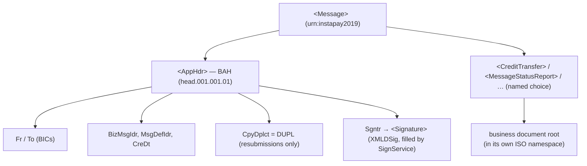

# 03 — The ISO 20022 Toolkit

> **In plain terms.** InstaPay only accepts messages written on **exact official
> forms**, in one precise dialect of XML, each one **sealed** so it can't be
> tampered with. This folder is the toolkit that does all of that paperwork:
> it **writes** the forms (builders), **reads** incoming forms (parsers),
> **stamps** them with a tamper-proof seal (signing), and **grammar-checks** every
> form against the official rulebook (XSD validation) before trusting it. It knows
> nothing about payments *as a business* — it is pure "document machinery", reused
> by everything else.
>
> - **Signing = a tamper-proof wax seal.** A tiny mathematical fingerprint of the
>   whole message, encrypted with our private key. Change one character and the
>   seal no longer matches, so the recipient instantly knows it was altered — and
>   that it really came from us.
> - **XSD = a grammar check.** The XSD is the official grammar book for each form.
>   Validation confirms every required field is present, in the right order, of the
>   right type — before any business logic runs.

**Code:** `src/iso20022/` —
`module` exposes six providers:
`XmlService`, `MessageBuilder`, `MessageParser`, `SignService`, `VerifyService`,
`XsdService`.

Jargon: **ISO 20022** = the global standard for financial messages. Each message
has a code like `pacs.008`. **XML** = the text format the messages are written in.
**BAH** = Business Application Header, the "envelope label" carrying sender,
receiver, ids, timestamp, and the signature. **C14N** = canonicalization, a way to
write XML in one exact byte-form so a signature is reproducible.

---

## The `<Message>` envelope

Every message on the wire is one InstaPay `<Message>` envelope
(namespace `urn:instapay2019`) that wraps exactly two things:

1. a **BAH** (`head.001.001.01`) — from/to BICs, `BizMsgIdr` (message id),
   `MsgDefIdr` (which message definition), `CreDt` (timestamp), an optional
   `CpyDplct=DUPL` duplicate flag, and the `Sgntr` (signature) block; and
2. exactly **one business document** under a named choice wrapper
   (`CreditTransfer`, `MessageStatusReport`, `EchoRequest`, …).



**Namespace strategy** (in `message.builder.ts`
and `iso-namespaces.ts`): the envelope,
header, and choice wrapper are in the default `urn:instapay2019` namespace; BAH
children use the `head:` prefix; each business document root **redeclares** the
default `xmlns` to its own ISO namespace so its children inherit it prefix-free.
This keeps output deterministic and reliably signable. Exact namespace/message-id
strings and the choice-element names live in
`iso-namespaces.ts` (`NS`, `MSG_DEF`,
`ENVELOPE_CHILD`, `SIG_ALGO`).

---

## `XmlService` — deterministic build & parse

`xml/xml.service.ts` wraps
`fast-xml-parser`. It is **order-preserving** (so signable, stable output) and
**namespace-prefix-insensitive** on lookups (so parsing tolerates any prefix).

| Method | What it does |
| --- | --- |
| `build(tree)` | Serialize an object tree to XML (no XML declaration). |
| `parse<T>(xml)` | Parse XML to an object tree, prefixes preserved. |
| `get(tree, path[])` | Walk nested tags by path, prefix-insensitive. |
| `pick(node, localName)` | Find a child by local name, ignoring its prefix. |
| `local(name)` | Strip a prefix (`head:Fr` → `Fr`). |
| `text(node)` | Coerce a node to scalar text. |

---

## `MessageBuilder` — writing the forms

`messages/message.builder.ts`
constructs each outbound message. Every BAH is emitted with an **empty `head:Sgntr`
placeholder** that `SignService` later fills. Typed parameters and the `TxStatus`
enum come from
`message.types.ts`.

| Build method | Message | Wrapper / doc root |
| --- | --- | --- |
| `buildCreditTransfer(p)` | **pacs.008.001.08** | `CreditTransfer` / `FIToFICstmrCdtTrf` |
| `buildStatusReport(p)` | **pacs.002.001.10** | `MessageStatusReport` / `FIToFIPmtStsRpt` |
| `buildReject(p)` | **admi.002.001.01** | `MessageReject` |
| `buildSignOn(p)` | **admn.001.001.01** | `SignOnRequest` / `AdmnSignOnReq` |
| `buildSignOff(p)` | **admn.003.001.01** | `SignOffRequest` / `AdmnSignOffReq` |
| `buildEchoRequest(p)` | **admn.005.001.01** | `EchoRequest` / `AdmnEchoReq` |
| `buildEchoResponse(p)` | **admn.006.001.01** | `EchoResponse` / `AdmnEchoResp` |

Scheme defaults baked into `buildCreditTransfer` (overridable per call): settlement
method `CLRG`, clearing system `BNT`, service level `SDVA`, local instrument `IPAY`,
category purpose `CASH`, charge bearer `SLEV`. These encode InstaPay conventions so
callers of the JSON API never supply them.

> **Note:** the builder does **not** produce `camt.056`, `admi.004`, `admn.002`, or
> `admn.004` — those are inbound-only and handled by the parser.

---

## `MessageParser` — reading the forms

`messages/message.parser.ts`
normalises any inbound `<Message>` into a flat `ParsedMessage` for routing and
matching. `parse(xml)` returns:

- `kind` — one of `CreditTransfer`, `MessageStatusReport`, `PaymentCancellation`,
  `EchoRequest`, `EchoResponse`, `SignOnResponse`, `SignOffResponse`,
  `SystemNotificationEvent`, `MessageReject`, `Unknown`.
- `header` — `fromBic`, `toBic`, `bizMsgIdr`, `msgDefIdr`, `creDt`, `duplicate`.
- extracted business fields — `instructionId`, `endToEndId`, `transactionId`,
  `originalInstructionId`, `status` (`TxStatus`), `reasonCode`, `amount`,
  `currency`, and the raw `tree`.

`detectKind` dispatches on the choice element present *or* the `MsgDefIdr` prefix,
so it recognises a message even if the wrapper naming varies. A cancellation
(`camt.056`) arrives as the `ReturnOfFunds` choice and is normalised to kind
`PaymentCancellation`, pulling `OrgnlInstrId` for matching.

---

## Signing — the tamper-proof seal

`signing/sign.service.ts` inserts a
**W3C XMLDSig enveloped signature** into the BAH; the properties follow the IPS
Digital Signing Guide:

| Property | Value |
| --- | --- |
| Signature method | **RSA-SHA256** |
| Digest method | **SHA-256** |
| Reference | `URI=""` — covers the **whole** `<Message>` |
| Transforms | `enveloped-signature`, then `xml-c14n11` |
| SignedInfo canonicalization | inclusive **C14N 1.0** |
| Placement | appended inside the empty `<Sgntr>` in the BAH |

The private key and certificate are read lazily from `TLS_KEY_PATH` /
`TLS_CERT_PATH` and cached. Algorithm URIs are `SIG_ALGO` in
`iso-namespaces.ts`.

**Verifying** (`signing/verify.service.ts`):
`verify(xml)` locates `//ds:Signature`, checks it, and returns
`{ valid, reason? }`. Trust model: if `TLS_CA_PATH` exists it **pins** that
certificate (production); otherwise it falls back to the certificate embedded in the
message's `KeyInfo` (fine for tests / mTLS peers).

**The C14N 1.1 shim** (`signing/c14n11.ts`):
`registerC14n11()` registers a `C14n11Canonicalization` class under the c14n11 URI.
It delegates to inclusive C14N 1.0, which is byte-identical to C14N 1.1 for InstaPay
payloads (no inherited `xml:*` attributes) — so both sign and verify agree.

```mermaid
sequenceDiagram
    participant B as MessageBuilder
    participant S as SignService
    participant N as Network / CI
    participant V as VerifyService (peer or us)
    B->>S: unsigned XML (empty &lt;Sgntr/&gt;)
    S->>S: digest whole Message (SHA-256, c14n11)
    S->>S: sign digest (RSA-SHA256), append &lt;Signature&gt; into &lt;Sgntr&gt;
    S->>N: signed &lt;Message&gt;
    N->>V: signed &lt;Message&gt;
    V->>V: recompute digest, check signature vs pinned/KeyInfo cert
    V-->>N: { valid: true/false }
```

---

## XSD validation — the grammar check

`validation/xsd.service.ts` validates
a message against the bundled InstaPay XSD schemas using **`xmllint-wasm`**
(WebAssembly libxml2 — no native build step needed).

- `onModuleInit()` loads `xmllint-wasm` and preloads every `*.xsd` from the bundled
  `schemas/` directory into memory; the root schema is `messages.xsd`
  (`targetNamespace urn:instapay2019`), which imports each message-specific XSD.
- `validate(xml)` returns `{ valid, errors[] }`. It **never throws** on a validation
  failure — invalid input becomes `valid:false` with human-readable errors, which
  the inbound gate turns into a signed `admi.002`.

---

## Where this toolkit is used

- **Inbound gate** — `inbound-validation.service.ts`
  runs *parse → verify → XSD* on every inbound message ([04](04-instapay-flows.md)).
- **Flows** — build & sign the responses (pacs.002, admn.006).
- **Exception filter** — builds & signs error responses (admi.002 / pacs.002 RJCT),
  see [10 — Error Handling](10-error-handling.md).

---

Next: **[04 — InstaPay Flows](04-instapay-flows.md)** ·
Back to the **[index](00-index.md)**.
