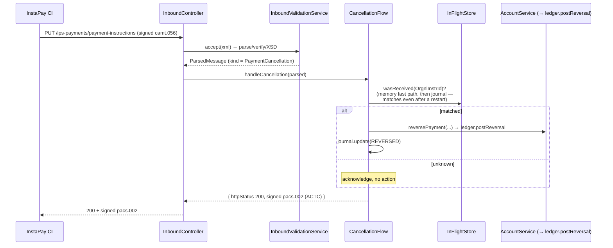

# 04 — InstaPay Flows (the business logic)

> **In plain terms.** If the [ISO 20022 toolkit](03-iso20022.md) is the paperwork
> machinery, this folder is the **operations desk** that decides what to *do* with
> each payment. It has two front doors: one the **network** knocks on (5 endpoints
> the InstaPay hub calls on us) and one **your own app** knocks on (a simple JSON
> `POST /payments`). Behind them sit three "playbooks": **receive** money coming
> in, **originate** money going out, and **cancel/reverse** a payment. A small
> memory notebook (the in-flight store) keeps track of payments still waiting for a
> reply, and a journal records every transaction for reconciliation.

**Code:** `src/instapay/` —
`module`.

Jargon: **debtor** = the payer; **creditor** = the payee/beneficiary. **InstrId**
(Instruction Id) = our per-payment key used to match the async reply. **DUPL** = a
resend flag telling the network "same payment, please don't double-process".

---

## The two front doors

### Door 1 — CI-facing endpoints (the network calls us)

`inbound/inbound.controller.ts`,
prefix `/ips-payments`, all consuming/producing **signed XML**. Every handler runs
the inbound gate (`inbound-validation.service.ts`)
first — *parse → verify signature → XSD validate* — before any logic.

| Endpoint | Receives | We do | Reply |
| --- | --- | --- | --- |
| `POST /ips-payments/service-requests` | `pacs.008` (inbound credit transfer) | validate → `ReceiverFlow.handleCreditTransfer` | **201** + signed `pacs.002` (`ACTC`) |
| `PUT /ips-payments/service-responses` | `pacs.002` (async result of a payment **we** sent) | `OriginatorFlow.handleServiceResponse` (fire-and-forget) | **204** |
| `PUT /ips-payments/payment-instructions` | `camt.056` (cancel) **or** `pacs.002` (confirm) | `CancellationFlow.handleCancellation` (camt.056) / ack (pacs.002) | **200** + signed `pacs.002` / **204** |
| `POST /ips-payments/system-notifications` | `admi.004` (system event) | validate + log | **204** |
| `PUT /ips-payments/health-checks` | `admn.005` (echo request) | build signed `admn.006` | **200** + signed `admn.006` |

### Door 2 — the JSON payments API (your app calls us)

`inbound/payments.controller.ts`,
prefix `/payments`, plain JSON.

| Route | Purpose |
| --- | --- |
| `POST /payments` | Originate a payment. Body = `OriginatePaymentDto`; returns `PaymentResultDto`. |
| `GET /payments/in-flight` | Diagnostics — `{ pending, received }` from the in-flight store. |
| `GET /payments` | Transaction journal feed (filter `since / status / direction / limit / offset`) for reconciliation. |
| `GET /payments/:instructionId` | One journal record (404 if unknown). |

> Route order matters: `GET /payments/in-flight` is declared **before**
> `GET /payments/:instructionId`, so `in-flight` resolves to the diagnostics
> handler, not the `:instructionId` param route.

See [04 — Integration Guide](../04-integration-guide.md) for the field-by-field DTO
and [sample payloads by destination](../04-integration-guide.md#sample-payloads-by-destination).

---

## `AccountService` — the money seam (stub + ledger)

`account.service.ts` is where "money"
meets your systems. It has no local wallet; it delegates durable money movement to
[`LedgerService`](05-ledger-money-safe.md), and beneficiary validation is a **stub**
you replace.

| Method | Today's behaviour | Seam for you |
| --- | --- | --- |
| `validateBeneficiary(tx)` | **Stub** — accepts everything (`{ ok: true }`) | Plug in your account lookup; return `{ ok:false, reasonCode:'AC01'\|'AC06', message }` to reject. |
| `creditBeneficiary(tx)` | `ledger.recordReceived(evt)` then `ledger.postCredit(evt)` (durable outbox) | The credit is recorded money-safe; wire your core via the ledger delivery. |
| `reversePayment(evt)` | `ledger.postReversal(evt)` | Same, for reversals. |

See [09 — Extending](09-extending.md) for exactly how to wire your real core here.

---

## Flow 1 — Receiving a credit transfer (we are the creditor)

`flows/receiver.flow.ts` ·
`handleCreditTransfer(msg)`.

```mermaid
sequenceDiagram
    participant CI as InstaPay CI
    participant IC as InboundController
    participant V as InboundValidationService
    participant R as ReceiverFlow
    participant A as AccountService (stub → LedgerService)
    participant B as MessageBuilder + SignService

    CI->>IC: POST /ips-payments/service-requests (signed pacs.008)
    IC->>V: accept(xml) — parse → verify → XSD
    alt structural failure
        V-->>IC: throws IsoStructuralError
        IC-->>CI: 400 + signed admi.002
    else valid
        V-->>IC: ParsedMessage
        IC->>R: handleCreditTransfer(parsed)
        R->>R: journal.record(INBOUND / RECEIVED)
        R->>A: validateBeneficiary()
        alt business reject
            A-->>R: { ok:false, reasonCode }
            R->>R: journal.update(FAILED)
            R-->>CI: 400 + signed pacs.002 (RJCT) via exception filter
        else accepted
            R->>A: creditBeneficiary() → ledger recordReceived + postCredit
            R->>R: store.recordReceived(InstrId); journal.update(COMPLETED)
            R->>B: build + sign pacs.002 (ACTC)
            R-->>IC: { httpStatus 201, xml }
            IC-->>CI: 201 + signed pacs.002 (ACTC)
        end
    end
```

A business rejection is thrown as an `IsoBusinessError`, which the global filter
renders as a signed `pacs.002 RJCT` — see [10](10-error-handling.md).

---

## Flow 2 — Originating a payment (we are the debtor)

`flows/originator.flow.ts` ·
`originate(req)` and `handleServiceResponse(msg)`. **This is the most important
flow.** The CI's reply is **asynchronous**: submitting returns `202` immediately,
and the real outcome (`pacs.002`) arrives *later* on `service-responses`, matched by
**Instruction Id**.

```mermaid
sequenceDiagram
    participant App as Your app
    participant PC as PaymentsController
    participant O as OriginatorFlow
    participant S as InFlightStore
    participant CL as IpsClient
    participant CI as InstaPay CI
    participant IC as InboundController

    App->>PC: POST /payments (JSON)
    PC->>O: originate(dto)
    O->>S: add(tx) — state PENDING (key = InstrId)
    O->>O: journal.record(OUTBOUND / PENDING)
    loop attempt 0..maxResubmissions
        O->>CL: submitServiceRequest(signed pacs.008)
        CL->>CI: POST /ips-payments/service-requests
        CI-->>CL: 202 Accepted
        Note over O: waitForResponse — up to RESPONSE_TIMEOUT_MS
        alt async pacs.002 arrives in time
            CI->>IC: PUT /ips-payments/service-responses (signed pacs.002)
            IC->>O: handleServiceResponse(parsed)
            O->>S: resolve(OrgnlInstrId, status) — unblocks waiter
            O-->>PC: PaymentResultDto (COMPLETED / FAILED)
            PC-->>App: 201 + result
        else timeout
            O->>S: markTimedOut; resubmit SAME InstrId with CpyDplct=DUPL
        end
    end
    Note over O: after all attempts with no reply → TIMED_OUT
```

**Step detail:**

1. Generate `instructionId = isoId('INSTR')`, `endToEndId` (caller's or `isoId('E2E')`),
   `transactionId = isoId('TX')`; `store.add(...)` (PENDING); journal record.
2. Loop `attempt = 0 .. maxResubmissions` (`MAX_RESUBMISSIONS`, default 2 → up to 3
   total tries). Each iteration builds & signs a fresh pacs.008; on attempts > 0 the
   BAH carries `CpyDplct=DUPL` and `store.incrementSubmissions`.
3. `client.submitServiceRequest(xml)`. If status **≠ 202** → return
   `REJECTED_AT_SUBMIT`.
4. `waitForResponse(tx)` blocks up to `RESPONSE_TIMEOUT_MS` (default 20 000 ms). If
   the async `pacs.002` resolves the tx → return `COMPLETED` (or `FAILED` if
   `RJCT`). On timeout → mark timed-out and loop to resend.
5. After the loop with no resolution → return `TIMED_OUT`.

**Outcome states** (in `PaymentResultDto.state`): `COMPLETED`, `FAILED`,
`TIMED_OUT`, `REJECTED_AT_SUBMIT`. On `COMPLETED`, the flow also fires
`ledger.postDebit(...)` so the outbound movement is recorded money-safe.

**The async match** (`handleServiceResponse`): the inbound `pacs.002` from
`service-responses` calls `store.resolve(originalInstructionId, status, reasonCode)`,
which invokes the per-transaction `resolve` callback that `waitForResponse` installed
— unblocking the still-waiting `originate` call. No match → warn and drop.

### DUPL resubmission & duplicate safety

The resubmission reuses the **same** `instructionId` / `endToEndId` /
`transactionId`; only the BAH `duplicate=true` flag and a fresh signature /
`bizMsgIdr` differ. Because the network dedupes on Instruction Id, a resend can never
double-pay — at-most-once settlement, at-least-once submission.

---

## Flow 3 — Cancellation (we are asked to reverse)

`flows/cancellation.flow.ts` ·
`handleCancellation(msg)`.



> A `pacs.002` **confirmation** arriving on `payment-instructions` (not a
> `camt.056`) is a fire-and-forget acknowledgement returning **204**.

---

## The outbound client — `IpsClient`

`outbound/ips.client.ts` is the HTTP
client that calls the CI. It targets `${CI_BASE_URL}/ips-payments`, adds mutual TLS
when `TLS_ENABLED=true`, and **never throws on non-2xx** — it returns
`{ status, body }` so flows decide.

| Method | Calls | Expects |
| --- | --- | --- |
| `submitServiceRequest(xml)` | `POST /service-requests` (signed pacs.008) | **202** |
| `participant(id, xml)` | `PUT /participants/{id}` (sign-on/off admn.001/003) | 200 |
| `healthCheck(xml)` | `PUT /health-checks` (admn.005) | 200 |

Sign-on/off and the heartbeat are driven by
`lifecycle.service.ts` — see
[07 — Runtime & Modes](07-runtime-and-modes.md).

---

## In-flight matching, timeout & duplicates — `InFlightStore`

`state/inflight.store.ts` is an
**in-memory** notebook with two maps:

- `byInstructionId` — originated payments awaiting a reply, keyed by **Instruction
  Id** (matched against the async `pacs.002`'s `OrgnlInstrId`).
- `receivedInstructionIds` — inbound instruction ids remembered so a later
  `camt.056` cancellation can be matched.

Key methods: `add`, `get`, `resolve(instrId, status, reasonCode)` (sets final state
and fires the waiter callback), `markTimedOut`, `incrementSubmissions`,
`recordReceived` / `wasReceived`, and `snapshot()` → `{ pending, received }`.

> **In-memory by design:** the *waiter callbacks* (a parked `POST /payments`
> request) are inherently process-local — they cannot survive a restart because
> the HTTP request itself would be gone. Everything that *should* outlive the
> process now does: the transaction journal is DB-backed (below) and cancellation
> matching reads it, so a restart only loses actively-waiting requests (they
> resolve as `TIMED_OUT` on the caller's side and reconcile via `GET /payments`).

---

## The transaction journal

`state/transaction.journal.ts` is
a record of every transaction (protocol-level, **not** the money ledger), keyed by
Instruction Id. A `TxRecord` holds: `instructionId`, `endToEndId`,
`transactionId`, `direction` (`INBOUND`/`OUTBOUND`), `amount`, `currency`,
`counterpartyName`, `counterpartyBic`, `status` (`PENDING` / `RECEIVED` /
`COMPLETED` / `FAILED` / `TIMED_OUT` / `REVERSED`), `reasonCode`, and
`createdAt` / `updatedAt` timestamps. `record`, `update`, `get`, and `list(filter)`
(all async) back the `GET /payments` reconciliation feed.

**Two implementations behind one abstract token** (bound in
`instapay.module.ts`, same pattern as the
ledger stores):

| Implementation | When | Where it lives |
| --- | --- | --- |
| `InMemoryTransactionJournal` | default (dev/test — zero dependencies) | a `Map`; lost on restart |
| `DbTransactionJournal` | `JOURNAL_DB_ENABLED=true` (defaults to `LEDGER_DB_ENABLED`) | the **dedicated ledger database**, `transactions` table (`db/<engine>/journal-schema.sql`) — survives restarts, shared across instances |

DB writes are **best-effort** (a journal blip must never fail a payment — the
money record is the outbox, which *is* fail-fast); reads throw so `GET /payments`
surfaces a DB outage instead of silently returning an empty feed. The
cancellation flow matches a `camt.056` against the journal too (INBOUND +
`RECEIVED`/`COMPLETED`/`REVERSED`), so **reversals still match after a restart or
on another instance** — the in-memory `wasReceived` set is just the fast path.
Shape detail: [08 — Data Model](08-data-model.md#the-transaction-journal).

---

Next: **[05 — Ledger & Money-Safe Delivery](05-ledger-money-safe.md)** ·
Back to the **[index](00-index.md)**.
