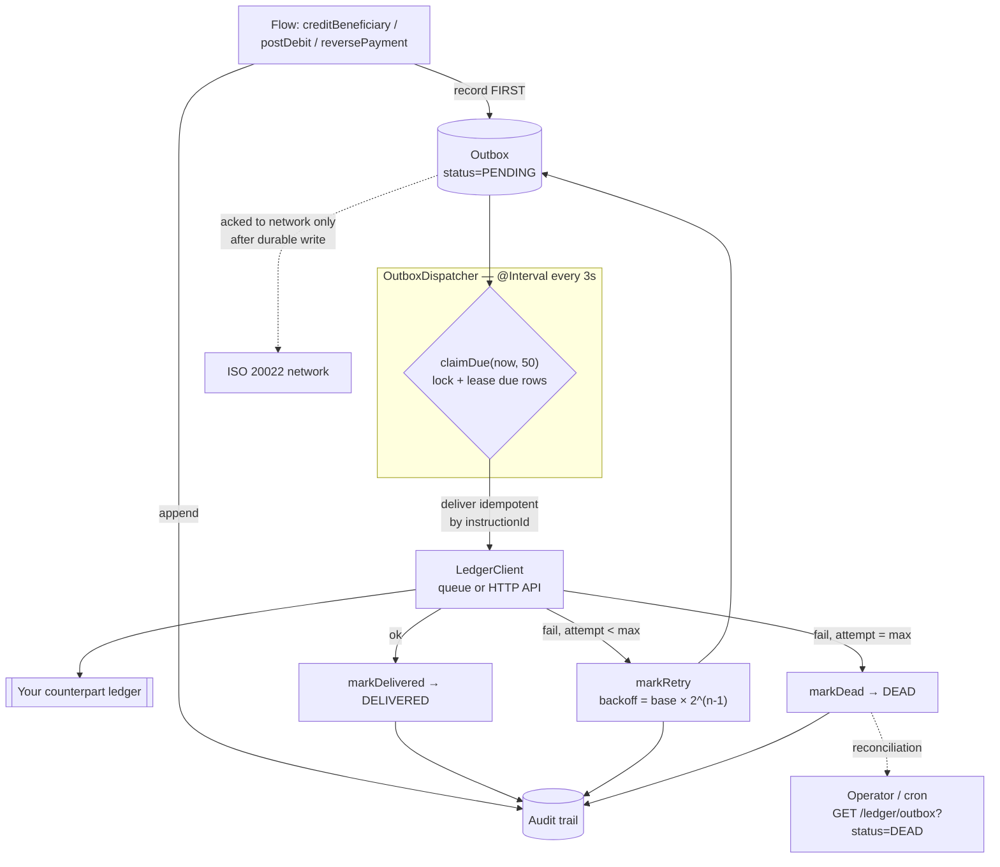

# 05 — Ledger & Money-Safe Delivery

> **In plain terms.** When money moves, we must *never* lose a payment and *never*
> post one twice. So before we tell the network "got it", we write the movement
> onto a durable **to-do list** (the **outbox**) and stamp a line in a permanent
> **logbook** (the **audit trail**). A background worker (the **dispatcher**) then
> works through the to-do list, handing each item to your real ledger, and keeps
> **retrying** until it's confirmed. If your ledger is briefly down, the item just
> waits — nothing is dropped. Because each item is tagged with the payment's unique
> id, your ledger can safely ignore a duplicate. If an item fails too many times it
> is set aside in a **dead-letter** pile for a human, never silently discarded.
>
> **Outbox = a durable to-do list so no payment is ever lost.**

**Code:** `src/ledger/` —
`module`. This page documents the **contract and
architecture**; the concrete DB store internals are being finalized separately, so
they are described at the interface level.

Jargon: **transactional outbox** = a proven pattern where you record an intent in a
durable store *in the same step* as the business change, then deliver it separately.
**Idempotent** = doing it twice has the same effect as doing it once. **Dead-letter**
= a holding area for messages that couldn't be delivered.

---

## Why this exists

A payment network is asynchronous and unreliable — the ledger may be briefly down, a
queue slow, the process restarted mid-delivery. Two failures must **never** happen
with money:

1. **Lost** — we acknowledged a payment but never posted it.
2. **Double-booked** — we posted the same movement twice on a retry.

The design makes the first impossible (durable record *before* ack) and the second
impossible (idempotent delivery keyed by Instruction Id).

---

## The money-safe path

1. **Record first.** `LedgerService` enqueues
   the movement to the outbox **and** appends an audit entry. Nothing is
   acknowledged to the network without this durable write.
2. **Dispatch with retries.** `OutboxDispatcher`
   claims due events and delivers each via
   `LedgerClient`.
3. **Idempotent delivery.** Keyed by `instructionId` (sent as `Idempotency-Key` /
   `idempotencyKey`), so a retry of an already-posted event is a no-op.
4. **Backoff + dead-letter.** On failure, retry with **exponential backoff**
   (`LEDGER_BACKOFF_MS × 2^(attempt-1)`). After `LEDGER_MAX_ATTEMPTS` the event goes
   **DEAD** for reconciliation — never silently dropped.
5. **Audit everything.** Each step appends: `RECEIVED`, `ENQUEUED`,
   `DELIVERY_ATTEMPT`, `DELIVERY_OK`, `DELIVERY_FAILED`, `DEAD_LETTER`.

---

## `LedgerService` — the entry point

`ledger.service.ts` is what the flows call
(via `AccountService`). It injects the two
stores by DI token: `@Inject(OUTBOX_STORE)` and `@Inject(AUDIT_STORE)`.

| Method | Effect |
| --- | --- |
| `recordReceived(evt)` | Audit `RECEIVED` (INBOUND) — no outbox row. |
| `postCredit(evt)` | Enqueue `CREDIT` / INBOUND + audit `ENQUEUED`. |
| `postDebit(evt)` | Enqueue `DEBIT` / OUTBOUND + audit `ENQUEUED`. |
| `postReversal(evt)` | Enqueue `REVERSAL` / INBOUND + audit `ENQUEUED`. |
| `listOutbox(filter)` / `listAudit(filter)` | Read APIs for the controller. |

A `MoneyEvent` carries `instructionId`, `amount`, `currency`, and optional
`endToEndId`, `transactionId`, `counterpartyBic`, `counterpartyName`.

---

## The store contract (the important seam)

Storage is **pluggable** behind two interfaces in
`ledger.types.ts`, bound to the DI tokens
`OUTBOX_STORE` and `AUDIT_STORE`.

### `OutboxStore`

| Method | Purpose |
| --- | --- |
| `enqueue(evt)` | Insert a PENDING event **idempotently** (unique `instructionId + type`). |
| `claimDue(now, limit)` | Atomically claim & lease due PENDING rows for delivery. |
| `markDelivered(id)` | Mark DELIVERED. |
| `markRetry(id, nextAttemptAt, attempts, error)` | Reschedule with backoff. |
| `markDead(id, error)` | Move to DEAD. |
| `get(id)` / `list(filter)` | Read. |

### `AuditStore`

| Method | Purpose |
| --- | --- |
| `append(entry)` | Append an audit line (assigns `id`, `ts`). |
| `list(filter)` | Read the trail (by `instructionId` / `action` / `since`). |

### Event & status shapes

- `OutboxEvent`: `id`, `instructionId` (idempotency key), `type`
  (`CREDIT`/`DEBIT`/`REVERSAL`), `direction` (`INBOUND`/`OUTBOUND`), `amount`,
  `currency`, counterparty fields, `status`, `attempts`, `nextAttemptAt`,
  `lastError`, timestamps.
- `OutboxStatus`: `PENDING` → `DELIVERED` | `DEAD`.
- `AuditAction`: `RECEIVED` · `ENQUEUED` · `DELIVERY_ATTEMPT` · `DELIVERY_OK` ·
  `DELIVERY_FAILED` · `DEAD_LETTER`.

Full column meanings are in [08 — Data Model](08-data-model.md).

---

## In-memory vs DB-backed stores

The module picks the implementation from **`LEDGER_DB_ENABLED`**:

| `LEDGER_DB_ENABLED` | Outbox / Audit implementation | Durability |
| --- | --- | --- |
| `false` (default) | `InMemoryOutboxStore` / `InMemoryAuditStore` (`memory-stores.ts`) | **Dev/test only** — lost on restart. |
| `true` | `DbOutboxStore` / `DbAuditStore` (`src/ledger/db/`) | Durable, against the dedicated transactional ledger DB. |

The DB DataSource is built **lazily and best-effort** in the token factories
(`ledger.module.ts`), so a briefly-unreachable
DB never crashes boot.

> **DB internals are being finalized by another agent.** This page intentionally
> documents the **contract** (the interfaces above) and the design intent below —
> not line-by-line internals of `src/ledger/db/*`.

### The separate, transactional ledger DB (design intent)

The outbox + audit live in their **own dedicated, transactional database**,
completely separate from the [logs DB](06-logging-and-query.md):

| | Ledger DB | Logs DB |
| --- | --- | --- |
| Purpose | Money movements — **must not be lost** | Observability — best-effort |
| Config | `LEDGER_DB_*` | `DB_*` / `LOG_*` |
| DataSource | `ledger-datasource.ts` | `logs-datasource.ts` |
| On failure | log + retry; never crash the app | drop the batch; never block a request |

They share **no pool and no failure domain**. The DataSource has `synchronize`
hard-disabled — the schema is owned by the DDL, not the app.

**Concurrency (design intent of `claimDue`).** The dispatcher is safe to run on
multiple instances: `claimDue` performs a **locked, leased claim** so two pollers
never grab the same row (`FOR UPDATE SKIP LOCKED` on Postgres/MySQL, `READPAST` on
SQL Server), and pushes `nextAttemptAt` forward as a short lease. If a pod crashes
mid-delivery, the lease expires and another retries — at-least-once, made safe by
idempotency.

---

## The dispatcher

`outbox.dispatcher.ts` runs on a NestJS
`@Interval` **every 3 seconds** (a re-entrancy guard prevents overlap), and is a
no-op unless `LEDGER_ENABLED=true`. Each tick:

1. `claimDue(Date.now(), 50)` — claim up to 50 due events.
2. For each: audit `DELIVERY_ATTEMPT`; `client.deliver(evt)`.
3. **Success** → `markDelivered` + audit `DELIVERY_OK`.
4. **Failure, attempt ≥ `LEDGER_MAX_ATTEMPTS`** → `markDead` + audit `DEAD_LETTER` +
   `logger.error`.
5. **Failure, otherwise** → backoff `delay = LEDGER_BACKOFF_MS × 2^(attempt-1)`,
   `markRetry(...)` + audit `DELIVERY_FAILED`.

> **Note (from the code):** the `@Interval` is a hard-coded **3000 ms**;
> `LEDGER_POLL_MS` (default 3000) is currently only surfaced in a startup log line,
> not wired into the interval. `LedgerClient` uses a fixed 10 s delivery timeout.

---

## Delivery transport — queue or HTTP

`ledger.client.ts` `deliver(evt)` never throws;
it returns `{ ok, error? }` and chooses transport by **`LEDGER_MODE`**:

| `LEDGER_MODE` | How | Config |
| --- | --- | --- |
| `queue` (default, recommended) | `ClientProxy.emit(queueName, payload)` — durable message queue | `LEDGER_QUEUE_TRANSPORT` (`RMQ`/`NATS`/`REDIS`), `LEDGER_QUEUE_URL`, `LEDGER_QUEUE_NAME` |
| `api` | `POST LEDGER_URL` with header `Idempotency-Key: instructionId` | `LEDGER_URL` |

The payload always carries `idempotencyKey` (= `instructionId`) plus the movement
details, so the receiving ledger can dedupe.

---

## Verifying & reconciling

`ledger.controller.ts` exposes two JSON read
APIs (and the microservice mirror is
`ledger.message.controller.ts`):

| Endpoint | Use |
| --- | --- |
| `GET /audit?instructionId=&action=&since=&limit=` | The full trail per payment. |
| `GET /ledger/outbox?status=&limit=` | Outbox state — `PENDING` / `DELIVERED` / `DEAD`. |

A reconciliation cron cross-checks the journal (`GET /payments`), the audit trail,
and the DEAD outbox rows; because delivery is idempotent, re-driving a fixed DEAD
event is always safe.

---

Next: **[06 — Logging & Query](06-logging-and-query.md)** ·
Back to the **[index](00-index.md)**. See also the top-level
[09 — Ledger & Audit](../09-ledger-and-audit.md) for the billions-scale schema
rationale.
