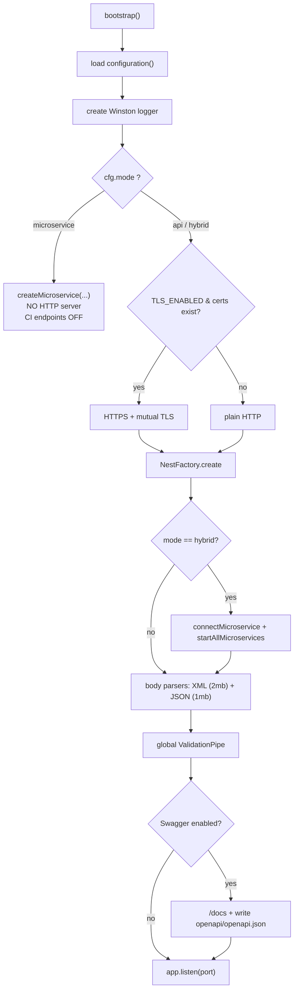

# 07 — Runtime & Run Modes

> **In plain terms.** This page is about **how the service starts up and in what
> shape it runs**. The same codebase can run three ways: as a normal **web service**
> that InstaPay talks to over HTTPS (`api`), as a **behind-the-scenes processor**
> your own apps call over an internal channel with no public web server
> (`microservice`), or as **both at once** (`hybrid`). Startup also decides whether
> to switch on the encrypted, both-sides-verified connection (mutual TLS), how to
> read the two different kinds of message body (raw XML vs JSON), and whether to
> publish the interactive API docs (which are turned off in production).

**Code:** `src/main.ts` ·
`src/microservice/` ·
`src/common/health/`.

---

## Bootstrap sequence

`main.ts` `bootstrap()`:



A global `ValidationPipe` (`whitelist`, `transform`, `forbidNonWhitelisted`) strips
unknown fields and coerces DTOs everywhere. Shutdown hooks are enabled so
`LifecycleService` can sign off
cleanly.

---

## The three run modes

Set by **`APP_MODE`** (see [02 — Config](02-config.md)):

| `APP_MODE` | HTTP server / CI endpoints | Internal microservice transport | Use |
| --- | --- | --- | --- |
| `api` (default) | ✅ | ❌ | The BancNet contract + JSON API over HTTPS. |
| `microservice` | ❌ (returns early, no HTTP) | ✅ | Internal processor only; **CI endpoints unavailable by design**. |
| `hybrid` | ✅ | ✅ | Both — HTTP *and* the internal transport attached. |

In `microservice` mode `bootstrap()` calls `NestFactory.createMicroservice(...)` and
returns before any HTTP server is created. In `hybrid`, the HTTP app additionally
`connectMicroservice(...)` + `startAllMicroservices()`.

### The internal transport

`microservice-options.ts`
`buildMicroserviceOptions(cfg)` maps `MS_TRANSPORT` to a NestJS transport:

| `MS_TRANSPORT` | Options |
| --- | --- |
| `TCP` (default) | `{ host: MS_HOST, port: MS_PORT, tlsOptions }` — mTLS when `MS_TLS=true` and certs exist (reuses participant certs). |
| `NATS` | `servers: [MS_URL ?? nats://127.0.0.1:4222]` |
| `REDIS` | `{ host: MS_HOST, port: MS_PORT }` |
| `RMQ` | `{ urls: [MS_URL ?? amqp://127.0.0.1:5672], queue: 'instapay', durable }` |

### Message patterns

| Pattern | Controller | Returns |
| --- | --- | --- |
| `{ cmd: 'payments.originate' }` | `payments.message.controller` | `PaymentResultDto` |
| `{ cmd: 'payments.in-flight' }` | payments.message.controller | `{ pending, received }` |
| `{ cmd: 'health.ping' }` | payments.message.controller | `{ status:'ok', ts }` |
| `{ cmd: 'ledger.transactions' \| 'ledger.transaction.get' \| 'ledger.audit' \| 'ledger.outbox' \| 'ledger.in-flight' }` | `ledger.message.controller` | journal / audit / outbox reads |
| `{ cmd: 'logs.query' }` | `logs.message.controller` | `{ count, logs, note? }` |

These mirror the HTTP JSON APIs — see [04](04-instapay-flows.md), [05](05-ledger-money-safe.md), [06](06-logging-and-query.md).

---

## Two kinds of request body

InstaPay endpoints exchange **raw XML**; our own API uses **JSON**. `main.ts`
registers both parsers:

```ts
app.use(text({ type: ['application/xml', 'text/xml'], limit: '2mb' }));
app.use(json({ limit: '1mb' }));
```

So `/ips-payments/*` receive the signed `<Message>` as a raw string, while
`/payments` receives a parsed JSON object.

---

## Mutual TLS

When `TLS_ENABLED=true` **and** the cert + key files exist, the HTTP server starts as
HTTPS with `requestCert` / `rejectUnauthorized` driven by
`TLS_REQUEST_CLIENT_CERT` — so the CI proves it is the CI and we prove we are us.
Details in [08 — Security & Compliance](../08-security-and-compliance.md). The
outbound `IpsClient` uses the same
certs for its side of mTLS.

---

## Health probes

`common/health/`:

| Route | Returns |
| --- | --- |
| `GET /health` (`health.controller`) | `{ status:'ok', mode, uptimeSec }` |
| `GET /health/ready` | `{ status:'ready', inFlight: { pending, received } }` |
| `GET /` (`root.controller`) | Service banner: mode, participant, and doc links. |

These are plain JSON (kept JSON by the exception filter — see [10](10-error-handling.md)).

---

## Swagger / OpenAPI (and production gating)

Swagger is **on everywhere except when `NODE_ENV=production`**, and can be forced
with `SWAGGER_ENABLED`. When enabled, `main.ts`:

- serves interactive docs at **`/docs`**, with the OpenAPI JSON at **`/docs-json`**
  and YAML at `/docs-yaml`; and
- unless `OPENAPI_EXPORT=false`, writes the spec to `openapi/openapi.json`
  (`OPENAPI_DIR` overrides the folder) for offline sharing / client codegen.

In production with Swagger off, the app simply logs `Swagger DISABLED (production)`
and skips all of the above.

---

## Auto-scaffolding databases

On first run the app can **auto-create** the ledger and logs schemas so a fresh DB
"just works". `common/db/scaffold.ts`
`scaffoldSchema(...)` runs at most once per process per database, is a **no-op when
the probe table already exists**, reads the DDL from `db/<engine>/…`, and swallows
errors so boot never crashes. Controlled by **`DB_AUTO_MIGRATE`** (default `true`).
It never modifies the DDL files themselves.

---

Next: **[08 — Data Model](08-data-model.md)** ·
Back to the **[index](00-index.md)**. See also the top-level
[02 — Setup](../02-setup.md).
