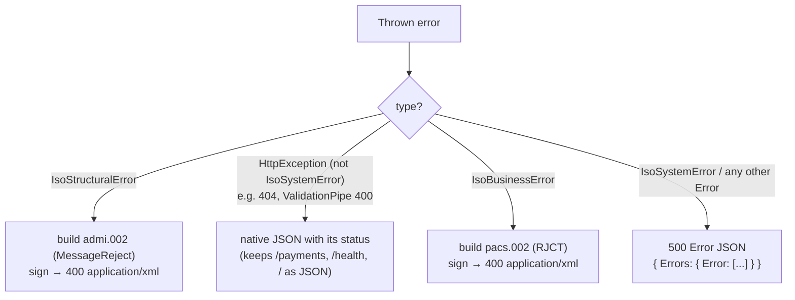

# 10 — Error Handling

> **In plain terms.** When something goes wrong, the service must answer in the
> **right language for whoever asked**. If the InstaPay network sent a bad or
> unauthorized message, we reply with a **signed official rejection** it understands
> (not a plain error). If your own app sent a bad JSON request, we reply with a
> normal **JSON error**. And an unexpected internal fault becomes a structured JSON
> error report. One central component decides which of these to produce — so error
> behaviour is consistent everywhere.

**Code:** `src/common/errors/iso-errors.ts`
· `src/common/filters/iso-exception.filter.ts`.

Jargon: an **exception filter** (NestJS) is a single place that catches thrown errors
and turns them into HTTP responses. `admi.002` = the ISO "message reject" form;
`pacs.002 RJCT` = a payment status report carrying a rejection.

---

## The three typed errors

`iso-errors.ts` defines three error classes,
each carrying an ISO **reason code**:

| Class | Thrown when | Reason codes seen | Renders as |
| --- | --- | --- | --- |
| `IsoStructuralError` | A message fails **parse / signature / schema** | `DU01` (parse), `DS02` (signature), `DU02` (schema) | HTTP **400** + signed **`admi.002`** |
| `IsoBusinessError` | A valid message is **rejected by business rules** | e.g. `AC01`, `AC06` | HTTP **400** + signed **`pacs.002` (`RJCT`)** |
| `IsoSystemError` | An unexpected / system fault | e.g. `SYS01` | HTTP **500** + Error JSON |

`IsoStructuralError` carries a `reference`; `IsoBusinessError` carries a rich context
(`originalInstructionId`, `amount`, `currency`, `fromBic`, …) so the filter can build
an accurate `pacs.002`.

Where they're thrown: the inbound gate
(`inbound-validation.service.ts`)
throws `IsoStructuralError('DU01'|'DS02'|'DU02', …)`; the
[ReceiverFlow](04-instapay-flows.md#flow-1--receiving-a-credit-transfer-we-are-the-creditor)
throws `IsoBusinessError` on beneficiary rejection.

---

## The global filter's decision tree

`iso-exception.filter.ts` is
registered globally (`APP_FILTER` in
`app.module.ts`) and catches everything:



1. **`IsoStructuralError`** → logs a warning, builds an `admi.002` via
   `MessageBuilder.buildReject(...)`, signs it, and sends **400** as
   `application/xml`.
2. **A plain `HttpException`** that is *not* an `IsoSystemError` (e.g. a `404`, or a
   `ValidationPipe` 400 on a bad JSON body) → returns its **native JSON** with its
   own status. This is what keeps the JSON routes (`/payments`, `/health`, `/`)
   answering in JSON.
3. **`IsoBusinessError`** → builds a `pacs.002` with `TxStatus.RJCT` (carrying the
   reason code and truncated additional info from the error context), signs it, sends
   **400** as `application/xml`.
4. **`IsoSystemError` or any other `Error`** → **500** JSON:

   ```json
   {
     "Errors": {
       "Error": [
         {
           "Source": "instapay-service",
           "ReasonCode": "SYS01",
           "Description": "…",
           "Recoverable": false,
           "Details": "…"
         }
       ]
     }
   }
   ```

### Signing is best-effort

The filter signs error XML with `trySign(...)`: if signing itself fails it logs and
returns the **unsigned** XML rather than masking the original fault — you always get
the real error back.

---

## Why XML for the network but JSON for your app

The network speaks ISO 20022, so a rejection it can act on must be a signed
`admi.002` / `pacs.002`. Your app speaks JSON, so its validation and lookup errors
stay JSON. The filter distinguishes the two by **error type**, not by URL — an
`IsoStructuralError`/`IsoBusinessError` (only ever raised on the CI path) yields XML,
while framework `HttpException`s (the JSON API path) yield JSON. This mapping is also
summarised in the top-level
[Integration Guide](../04-integration-guide.md#response--http-codes-at-a-glance) and
[Architecture](../03-architecture.md#how-an-inbound-request-flows).

---

## HTTP status summary

| Situation | HTTP | Body |
| --- | --- | --- |
| Structural failure (parse/signature/schema) | 400 | signed `admi.002` |
| Business rejection | 400 | signed `pacs.002` (`RJCT`) |
| Bad JSON request (ValidationPipe) / not found | 400 / 404 | native JSON |
| System / unexpected fault | 500 | Error JSON |

---

Next: **[11 — Request Walkthroughs](11-request-walkthroughs.md)** ·
Back to the **[index](00-index.md)**.
