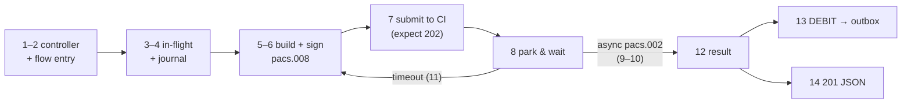
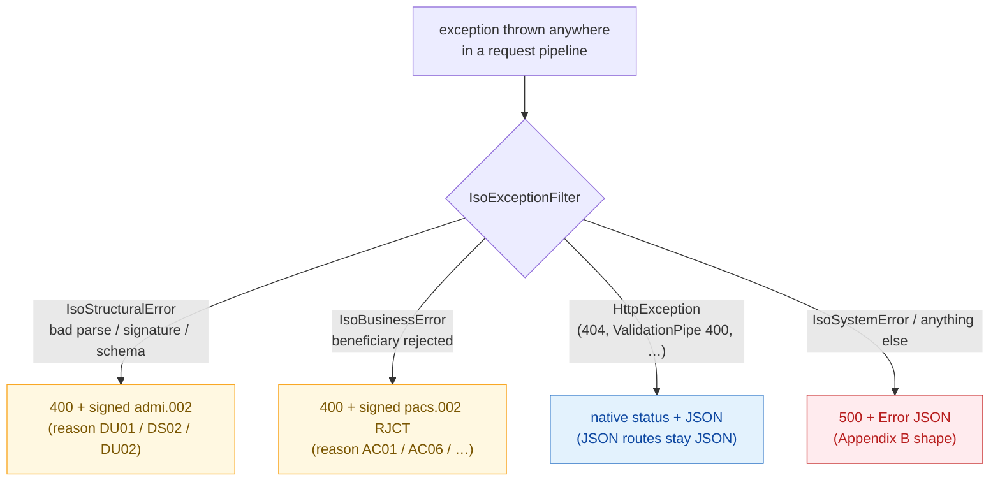

# 11 — Request Walkthroughs (every endpoint, step by step)

> **In plain terms.** This page answers one question for **every endpoint**:
> *"when a request hits this API, where exactly does it go next?"* Each walkthrough
> is a numbered trail through the real source files — controller → service → flow →
> builder/signer → response — so you can follow a payment through the code the same
> way a debugger would. Business framing: **cash-out** = your app sends money,
> **cash-in** = the network delivers money to your customer.

**Companion doc:** [docs/10 — Transaction Flows](../10-transaction-flows.md) has the
end-to-end business diagrams (cash-in / cash-out / reversal / ledger delivery).
This page is the code-level version of the same journeys.

---

## Before any handler runs — the shared pipeline

Every HTTP request passes through the same machinery, set up in
`main.ts`:

1. **TLS termination** — if `TLS_ENABLED=true` and certs exist, the server is
   HTTPS with optional client-cert verification (mutual TLS).
2. **Body parsing** — `application/xml` / `text/xml` bodies arrive as a raw
   string (`express.text`, 2 MB limit); everything else is JSON (1 MB limit).
   That is why XML controllers receive `@Body() xml: string`.
3. **Global `ValidationPipe`** (`whitelist`, `transform`,
   `forbidNonWhitelisted`) — JSON DTOs are validated *before* the controller
   method runs; a bad body never reaches business code (→ 400 JSON).
4. **Routing** — NestJS dispatches to the controller method below.
5. **Global exception filter** —
   `iso-exception.filter.ts`
   catches anything thrown anywhere downstream and renders the correct reply
   (signed `admi.002`, signed `pacs.002 RJCT`, or JSON — see
   [the error-path section](#error-paths--what-a-throw-turns-into)).

---

## Cash-out — `POST /payments` (your app sends money)

The most important journey. One JSON call in; signed XML, submission, async
matching, and ledger posting all happen inside.

| # | Where | What happens |
| --- | --- | --- |
| 1 | `payments.controller.ts` · `PaymentsController.originate()` | Entry point. The body was already validated against `OriginatePaymentDto` (amount format, BIC pattern, name lengths) by the global pipe. Delegates straight to the flow. |
| 2 | `originator.flow.ts` · `OriginatorFlow.originate()` | Generates the three ids — `instructionId` (`INSTR…`), `endToEndId` (caller's or `E2E…`), `transactionId` (`TX…`) via `id.util.ts`. |
| 3 | `inflight.store.ts` · `InFlightStore.add()` | Registers the payment as **in-flight**, keyed by `instructionId` — this is what the async reply will be matched against later. |
| 4 | `transaction.journal.ts` · `TransactionJournal.record()` | Journal record `OUTBOUND / PENDING` — visible immediately at `GET /payments`. |
| 5 | `message.builder.ts` · `MessageBuilder.buildCreditTransfer()` | Builds the `pacs.008` XML: `<Message>` envelope + BAH (head.001) + `FIToFICstmrCdtTrf` with debtor/creditor/amount. |
| 6 | `sign.service.ts` · `SignService.sign()` | Embeds a W3C XMLDSig signature (RSA-SHA256, enveloped, c14n11) into `<head:Sgntr>`. |
| 7 | `ips.client.ts` · `IpsClient.submitServiceRequest()` | `POST {CI_BASE_URL}/ips-payments/service-requests` over (m)TLS. Never throws — returns `{ status, body }`. **Not 202 → step 12 with `REJECTED_AT_SUBMIT`.** |
| 8 | `OriginatorFlow.waitForResponse()` | The request now **parks**: a Promise waits up to `RESPONSE_TIMEOUT_MS` for the async result. The resolver callback is stored on the in-flight tx. |
| 9 | *(meanwhile, a separate inbound request)* `inbound.controller.ts` · `serviceResponses()` | The CI calls `PUT /ips-payments/service-responses` with the signed `pacs.002` result — see [its own walkthrough below](#put-ips-paymentsservice-responses--async-result-of-a-cash-out). |
| 10 | `OriginatorFlow.handleServiceResponse()` → `InFlightStore.resolve()` | The `pacs.002`'s `OrgnlInstrId` looks up the parked transaction and fires its resolver — **step 8 unblocks**. |
| 11 | *(timeout path)* `OriginatorFlow.originate()` loop | No reply in time → `store.markTimedOut()`, then resubmit the **same** `instructionId` with the BAH `CpyDplct=DUPL` flag (fresh signature), up to `MAX_RESUBMISSIONS`. All attempts exhausted → `TIMED_OUT`. |
| 12 | `OriginatorFlow.result()` | Maps the outcome to `PaymentResultDto.state` (`COMPLETED` / `FAILED` / `TIMED_OUT` / `REJECTED_AT_SUBMIT`), updates the journal, and — **on `COMPLETED` only** — calls `LedgerService.postDebit()`. |
| 13 | `ledger.service.ts` · `LedgerService.post('DEBIT', …)` | The DEBIT money event is enqueued to the **durable outbox** + written to the **audit trail** (`ENQUEUED`). Delivery to your core happens in the background — see [the dispatcher walkthrough](#background--outboxdispatcher-delivers-money-events). |
| 14 | back in `PaymentsController` | The `PaymentResultDto` is serialized → **201 JSON** to your app. |

### Read endpoints on the same controller

| Endpoint | Path through the code |
| --- | --- |
| `GET /payments` | `PaymentsController.list()` → `TransactionJournal.list(filter)` (filters `since/status/direction/limit/offset` applied in memory) → `{ count, transactions[] }`. |
| `GET /payments/in-flight` | `PaymentsController.inFlight()` → `InFlightStore.snapshot()` → `{ pending, received }`. Declared **before** the param route so `in-flight` is not captured as an `:instructionId`. |
| `GET /payments/:instructionId` | `PaymentsController.getOne()` → `TransactionJournal.get(id)` → record, or `NotFoundException` → the exception filter's `HttpException` branch → **404 JSON**. |

---

## Cash-in — `POST /ips-payments/service-requests` (the network delivers money)

| # | Where | What happens |
| --- | --- | --- |
| 1 | `inbound.controller.ts` · `InboundController.serviceRequests()` | Entry point. Body is the raw signed XML string. |
| 2 | `inbound-validation.service.ts` · `InboundValidationService.accept()` | The **inbound gate**, in order: ① `message.parser.ts` `parse()` (unparseable → `IsoStructuralError DU01`), ② `verify.service.ts` `verify()` (bad signature → `DS02`), ③ `xsd.service.ts` `validate()` (schema violation → `DU02`). Any throw → filter → **400 + signed `admi.002`**. |
| 3 | `receiver.flow.ts` · `ReceiverFlow.handleCreditTransfer()` | Journal record `INBOUND / RECEIVED`. |
| 4 | `account.service.ts` · `AccountService.validateBeneficiary()` | **Your business hook** (stub: accepts all). Returning `{ ok:false, reasonCode:'AC01' }` → journal `FAILED` → `IsoBusinessError` thrown → filter → **400 + signed `pacs.002 RJCT`**. |
| 5 | `AccountService.creditBeneficiary()` | Two ledger calls: `LedgerService.recordReceived()` (audit `RECEIVED` — proof of exactly what arrived) then `LedgerService.postCredit()` (CREDIT event → durable outbox + audit `ENQUEUED`). |
| 6 | back in `ReceiverFlow` | `InFlightStore.recordReceived(instrId)` — remembered so a later `camt.056` cancellation can be matched. Journal → `COMPLETED`. |
| 7 | `message.builder.ts` · `buildStatusReport()` + `SignService.sign()` | Builds and signs the `pacs.002` with `TxSts=ACTC`, echoing `OrgnlInstrId` / `OrgnlEndToEndId` / `OrgnlTxId`. |
| 8 | back in `InboundController` | **201 + signed `pacs.002`** (application/xml) to the CI. The CREDIT is already durable (step 5) — the ACK is never sent before the record exists. |

---

## `PUT /ips-payments/service-responses` — async result of a cash-out

| # | Where | What happens |
| --- | --- | --- |
| 1 | `InboundController.serviceResponses()` | Entry point (raw XML). |
| 2 | `InboundValidationService.accept()` | Same three-step gate (parse → signature → XSD). |
| 3 | `originator.flow.ts` · `handleServiceResponse()` | No `OrgnlInstrId` in the message → log a warning and drop (still 204 — nothing to match). |
| 4 | `inflight.store.ts` · `resolve(instrId, status, reasonCode)` | Looks up the parked cash-out by Instruction Id, stores the final status, and fires the waiter callback — the original `POST /payments` request (parked at its step 8) resumes. Unknown id → warn + drop. |
| 5 | back in `InboundController` | **204 No Content** — fire-and-forget from the CI's perspective. |

---

## `PUT /ips-payments/payment-instructions` — cancellation or confirmation

| # | Where | What happens |
| --- | --- | --- |
| 1 | `InboundController.paymentInstructions()` | Entry point (raw XML). |
| 2 | `InboundValidationService.accept()` | Parse → signature → XSD. The parser sets `parsed.kind`. |
| 3a | *if `kind === 'PaymentCancellation'` (camt.056)* → `cancellation.flow.ts` · `handleCancellation()` | `InFlightStore.wasReceived(OrgnlInstrId)`? **Matched:** `AccountService.reversePayment()` → `LedgerService.postReversal()` (REVERSAL → outbox + audit), journal → `REVERSED`. **Unknown:** log, no action — nothing to undo. Both paths: build + sign a `pacs.002 ACTC` → **200 XML** (so the CI stops re-sending). |
| 3b | *else (a `pacs.002` confirmation)* | Fire-and-forget acknowledgement → **204**. |

---

## `POST /ips-payments/system-notifications` — CI system event

1. `InboundController.systemNotifications()` → `InboundValidationService.accept()`
   (full gate, so forged notifications are rejected).
2. Log the event (`admi.004`) → **204**. No business action — extend here if you
   need to react to CI events (see [09 — Extending](09-extending.md)).

## `PUT /ips-payments/health-checks` — CI echo

1. `InboundController.healthChecks()` → `InboundValidationService.accept()`.
2. `MessageBuilder.buildEchoResponse()`
   builds the `admn.006` echoing the request's `bizMsgIdr`; `SignService.sign()`.
3. **200 + signed `admn.006`** — proves to the CI that we can parse, verify, build,
   and sign round-trip.

---

## Ledger & audit reads — `GET /audit`, `GET /ledger/outbox`

| Endpoint | Path through the code |
| --- | --- |
| `GET /audit` | `ledger.controller.ts` · `audit()` → `LedgerService.listAudit(filter)` → the `AUDIT_STORE` implementation: `memory-stores.ts` by default, or `db/db-audit.store.ts` when `LEDGER_DB_ENABLED=true` → `{ count, entries[] }`. |
| `GET /ledger/outbox` | `LedgerController.outbox()` → `LedgerService.listOutbox(filter)` → `OUTBOX_STORE` impl (`memory-stores.ts` / `db/db-outbox.store.ts`) → `{ count, events[] }`. |

The store binding (memory vs DB) is decided once, in
`ledger.module.ts` — see
[05 — Ledger & Money-Safe Delivery](05-ledger-money-safe.md).

## Logs read — `GET /logs`

1. `logs.controller.ts` · `query()` — if
   `LOG_DB_ENABLED` ≠ `true`, short-circuits with `{ count:0, logs:[], note }`
   (never errors the caller).
2. `logs-query.service.ts` ·
   `query()` builds a parameterized SELECT over the partitioned `app_logs` table
   (filters map to indexed columns) via
   `logs-datasource.ts`.
3. **200 JSON** `{ count, logs[] }`; a query failure is caught and returned as a
   `note`, never a 500.

## Health & root — `GET /health`, `GET /health/ready`, `GET /`

| Endpoint | Path through the code |
| --- | --- |
| `GET /health` | `health.controller.ts` · `live()` — mode + uptime from memory. Dependency-light on purpose: answers even under load. |
| `GET /health/ready` | `HealthController.ready()` → `InFlightStore.snapshot()`. |
| `GET /` | `root.controller.ts` · `root()` — service info + doc links (hidden from Swagger). |

## Documentation — `GET /docs`, `/docs-json`, `/docs-yaml`

Served by Swagger, assembled in `main.ts` from the
`@Api*` decorators on the controllers. On boot the JSON spec is also written to
[`openapi/openapi.json`](../../openapi/openapi.json) (`OPENAPI_EXPORT`/`OPENAPI_DIR`).

---

## Microservice message patterns (queue instead of HTTP)

In `microservice` / `hybrid` mode (`main.ts` +
`microservice-options.ts`), the
same capabilities are reachable over TCP/NATS/Redis/RMQ. The handlers are thin —
they call **exactly the same classes** as the HTTP controllers, so every
walkthrough above applies unchanged from step 2 onward:

| Pattern | Handler | Then follows |
| --- | --- | --- |
| `{ cmd: 'payments.originate' }` | `payments.message.controller.ts` · `originate()` | the [cash-out walkthrough](#cash-out--post-payments-your-app-sends-money) from step 2 (`OriginatorFlow.originate()`). |
| `{ cmd: 'payments.in-flight' }` / `{ cmd: 'ledger.in-flight' }` | same / `ledger.message.controller.ts` | `InFlightStore.snapshot()`. |
| `{ cmd: 'health.ping' }` | `payments.message.controller.ts` · `ping()` | returns `{ status, ts }` directly. |
| `{ cmd: 'ledger.transactions' }` / `{ cmd: 'ledger.transaction.get' }` | `ledger.message.controller.ts` | `TransactionJournal.list()` / `.get()` — same as `GET /payments`. |
| `{ cmd: 'ledger.audit' }` / `{ cmd: 'ledger.outbox' }` | `ledger.message.controller.ts` | `LedgerService.listAudit()` / `.listOutbox()` — same as the HTTP reads. |
| `{ cmd: 'logs.query' }` | `logs.message.controller.ts` | `LogsQueryService.query()` — same as `GET /logs`. |

---

## Background — `OutboxDispatcher` delivers money events

Not an endpoint — a poller started at module init. This is the second half of
every money movement (steps 13/5/3a above end at the outbox; this picks up
from there).

| # | Where | What happens |
| --- | --- | --- |
| 1 | `outbox.dispatcher.ts` · `onModuleInit()` | If `LEDGER_ENABLED=true`, starts a `setInterval` at `LEDGER_POLL_MS`; otherwise stays idle (events accumulate, still queryable). |
| 2 | `tick()` | `OutboxStore.claimDue(now, 50)` — atomically claims due PENDING events (re-entrance guarded by the `running` flag). |
| 3 | per event | Audit `DELIVERY_ATTEMPT`, then `ledger.client.ts` · `deliver(evt)`. |
| 4 | `LedgerClient` | `LEDGER_MODE=queue` → `ClientProxy.emit()` onto a durable queue (RMQ/NATS/Redis); `LEDGER_MODE=api` → `POST LEDGER_URL` with the **`Idempotency-Key: {instructionId}`** header. Either way your ledger dedupes retries — no double-booking. |
| 5a | success | `OutboxStore.markDelivered()` + audit `DELIVERY_OK`. Event reaches `DELIVERED` — terminal. |
| 5b | failure, attempts left | `markRetry()` with exponential backoff (`base × 2^(attempt−1)`) + audit `DELIVERY_FAILED`. Back to PENDING; a later tick retries. |
| 5c | failure, max attempts | `markDead()` + audit `DEAD_LETTER` + error log. Terminal but never lost — `GET /ledger/outbox?status=DEAD`. |

## Background — participant lifecycle (sign-on / heartbeat / sign-off)

`lifecycle.service.ts`:

1. **Boot** (`onModuleInit`, when `AUTO_SIGN_ON=true`): build + sign `admn.001` →
   `IpsClient.participant()` → `PUT {CI}/ips-payments/participants/{id}` → 200
   marks us signed on.
2. **Every 30 s** (`heartbeat`, when signed on and `HEALTHCHECK_INTERVAL_MS > 0`):
   signed `admn.005` echo → `IpsClient.healthCheck()`.
3. **Shutdown** (`onApplicationShutdown`): signed `admn.003` sign-off. Enabled by
   `app.enableShutdownHooks()` in `main.ts`.

---

## Error paths — what a throw turns into

Wherever a walkthrough above says "throws", the request short-circuits to
`iso-exception.filter.ts`:

Two guarantees worth knowing:

- **XML errors for the network, JSON errors for your apps.** Only the
  `/ips-payments/*` pipeline produces signed XML rejects; `/payments`, `/health`,
  `/logs`, etc. always fail in JSON.
- **Signing a reject can never mask the original fault** — `trySign()` falls back
  to unsigned XML if the signer itself fails.

Full detail: [10 — Error Handling](10-error-handling.md).

---

Back to the **[index](00-index.md)** · Business-level diagrams:
**[docs/10 — Transaction Flows](../10-transaction-flows.md)**.
